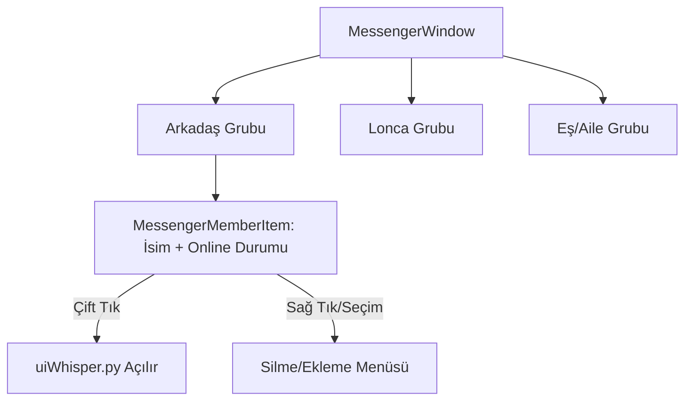

# 🎓 Metin2 Skills: `uiMessenger.py` (Arkadaş Listesi / Messenger)

`uiMessenger.py`, oyundaki sosyal ağını (Arkadaşların, Lonca üyelerin ve Eşin) yöneten penceredir. Kimlerin çevrimiçi olduğunu görmeni ve onlarla hızlıca iletişim kurmanı sağlar.

---

## 🔍 Neleri Yönetir?

### 1. Arkadaş ve Lonca Listesi
Arkadaşlarını ve lonca üyelerini gruplandırır. Çevrimiçi (`Online`), Çevrimdışı (`Offline`) ve Mobil durumlarını farklı ikonlarla (`IMAGE_FILE_NAME`) gösterir.

### 2. Sosyal Etkileşimler
- **Fısıltı:** Bir isme çift tıklandığında veya butonla fısıltı penceresi açar.
- **Arkadaş Ekle/Sil:** Yeni oyuncu ekleme veya mevcutları listeden çıkarma işlemlerini `net.SendMessengerAddByNamePacket` gibi komutlarla yapar.

### 3. Dinamik Liste Yönetimi (`OnRefreshList`)
Bir arkadaşın oyuna girdiğinde veya çıktığında listenin anlık olarak güncellenmesini ve doğru sırada (önce çevrimiçiler) görünmesini sağlar.

---

## 🛠️ Modifikasyon ve Kritik Uyarılar

### ✅ Arkadaş Notu Ekleme:
Oyuncuların arkadaşlarının yanına küçük notlar (örn: "Savaşçı-Tank") ekleyebileceği bir sistem geliştirmek için `MessengerMemberItem` sınıfına yeni bir `TextLine` ekleyebilirsin.

### ✅ Gelişmiş Bilgi Gösterimi:
Arkadaşının sadece online olduğunu değil, hangi haritada veya hangi kanalda (CH) olduğunu da göstermek için sunucu taraflı paketlerle buradaki veriyi genişletebilirsin.

### ⚠️ Liste Boyutu ve Performans:
Eğer bir oyuncunun yüzlerce arkadaşı varsa, `OnRefreshList` fonksiyonu her güncellemede tüm listeyi baştan oluşturduğu için anlık takılmalara (FPS Drop) neden olabilir.

---

## 🚨 Hata Ayıklama (Debug)

**"Arkadaş ekliyorum ama listede görünmüyor" sorunu:**
1.  `messenger.RefreshGuildMember` veya `messenger.RefreshFriend` fonksiyonlarının tetiklendiğinden emin ol.
2.  `MessengerWindow.py` (UIScript) dosyasındaki `ScrollBar` ayarlarını kontrol et; bazen liste aşağıda kalıyor ama scroll çalışmıyor olabilir.

---

## 📉 uiMessenger.py Hiyerarşi Şeması

---

**Sonuç:** `uiMessenger.py`, oyunun "Rehberidir". Sosyal etkileşimin hızlı ve hatasız olması, oyuncuların oyunda kalma süresini (Retention) artırır.
