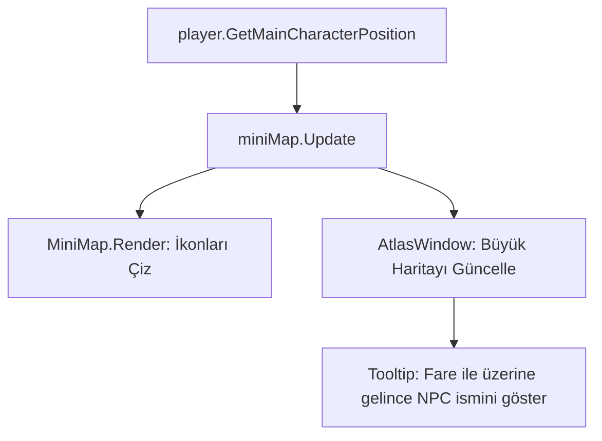

# 🎓 Metin2 Skills: `uiMiniMap.py` (Mini Harita ve Radar)

`uiMiniMap.py`, oyuncunun dünyadaki konumunu görmesini, çevresindeki NPC ve düşmanları takip etmesini sağlayan "Gözcü" sistemidir.

---

## 🔍 Neleri Yönetir?

### 1. Mini Harita (Sağ Üst)
Karakterin etrafındaki küçük alanı gösterir. Yakınlaştırma (Scale Up) ve Uzaklaştırma (Scale Down) işlemlerini yönetir.

### 2. Büyük Harita (Atlas - M Tuşu)
Tüm haritayı kaplayan geniş görünümü sağlar. Burada krallık alanları, ışınlanma noktaları ve görev hedefleri görünür.

### 3. Koordinat ve Gözlemci Bilgisi
Oyuncunun anlık (X, Y) koordinatlarını ve onu izleyen (Spectator) kişi sayısını ekrana yansıtır.

---

## 🛠️ Modifikasyon ve Kritik Uyarılar

### ✅ Koordinat Göstergesini Kapatmak/Açmak:
`constInfo.MINIMAP_POSITIONINFO_ENABLE` ayarı 0 ise koordinatlar gizlenir, 1 ise görünür. Eğer oyuncuların koordinatlarını görmesini istemiyorsan buradan kapatabilirsin.

### ✅ Bazı Haritalarda Minimapi Devre Dışı Bırakmak:
`CANNOT_SEE_INFO_MAP_DICT` sözlüğüne bir harita adı (örn: `metin2_map_skipia_dungeon_01`) eklersen, o haritaya girildiğinde minimap otomatik olarak gizlenir. Labirent gibi haritalarda oyuncuları zorlamak için harika bir yöntemdir.

### ⚠️ Atlas Hataları:
Eğer `AtlasWindow.py` (UIScript) dosyasında bir hata varsa, "M" tuşuna basıldığında oyun donabilir. Çünkü Atlas penceresi tüm harita verisini aynı anda işlemeye çalışır.

---

## 🚨 Hata Ayıklama (Debug)

**"Haritada noktalar görünüyor ama harita resmi siyah" sorunu:**
Bu sorun genellikle o haritaya ait `atlas.tga` dosyasının eksik olmasından veya `miniMap.py` modülünün o haritayı tanıyamamasından kaynaklanır.

---

## 📉 uiMiniMap.py Veri Akışı

---

**Sonuç:** `uiMiniMap.py`, oyuncunun yolunu bulmasını sağlayan navigasyon sistemidir. Buradaki kısıtlamalar veya geliştirmeler oyunun keşif hissini doğrudan etkiler.
