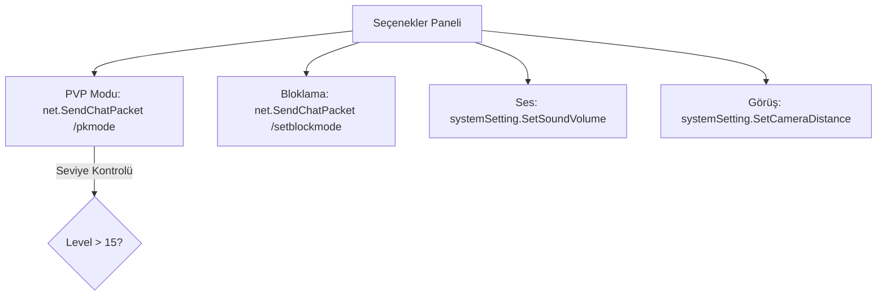

# 🎓 Metin2 Skills: `uiOption.py` (Genel Seçenekler Paneli)

`uiOption.py`, oyunun temel oynanış ayarlarını (PVP Modu, Engelleme Seçenekleri, Ses Ayarları) yöneten ana dosyadır. Modern clientlerde bu dosya genellikle `uiSystemOption` ve `uiGameOption` olarak ikiye ayrılsa da, temel mantık burada yatar.

---

## 🔍 Neleri Yönetir?

### 1. PVP Modu Seçimi
Oyuncunun saldırı modunu (Barış, İntikam, Lonca, Serbest) değiştirmesini sağlar.
- **Koruma:** `PVPMODE_PROTECTED_LEVEL` (genellikle Lv. 15) altındaki oyuncuların PVP modunu değiştirmesini engeller.

### 2. Engelleme (Block) Modları
Ticaret, Grup, Lonca, Fısıltı ve Arkadaşlık isteklerini tek tıkla kapatmayı sağlar. 
- **Komut:** `/setblockmode` komutu ile sunucuya hangi isteklerin reddedileceğini iletir.

### 3. Ses ve Müzik Kontrolü
Oyunun genel ses seviyesini ve arka plan müziğini `systemSetting` üzerinden ayarlar.

### 4. Kamera ve Sis (Fog) Ayarları
Görüş mesafesini (Kısa/Uzun) ve sis yoğunluğunu belirleyerek oyunun performansını (FPS) doğrudan etkiler.

---

## 🛠️ Modifikasyon ve Kritik Uyarılar

### ✅ Yeni Engelleme Seçenekleri:
Eğer oyuna "Evlilik Teklifi Engelle" veya "Ekipman Görüntüleme Engelle" gibi yeni özellikler eklendiyse, bunların butonlarını ve `blockMode` bitlerini buraya eklemelisin.

### ✅ PVP Koruma Seviyesi:
`constInfo.PVPMODE_PROTECTED_LEVEL` değerini değiştirerek oyuncuların kaçıncı seviyeden sonra PVP açabileceğini belirleyebilirsin.

### ⚠️ Bloklama Bitleri:
`blockMode` değişkeni bir "Bitmask"tir. Yani her bir seçenek (Ticaret=1, Grup=2, Lonca=4 vb.) bir sayıya karşılık gelir. Bunların sırasını karıştırmak, oyuncunun fısıltıyı kapatmak isterken ticareti kapatmasına yol açabilir.

---

## 🚨 Hata Ayıklama (Debug)

**"PVP modunu değiştiriyorum ama karakterin ismi değişmiyor" sorunu:**
1.  `net.SendChatPacket("/pkmode ...")` komutunun sunucuya iletildiğinden emin ol.
2.  `OnChangePKMode` fonksiyonunun tetiklenip tetiklenmediğini kontrol et.

---

## 📉 uiOption.py Ayar Haritası

---

**Sonuç:** `uiOption.py`, oyuncunun oyun içindeki "Konfor" ve "Güvenlik" ayarlarını yaptığı kontrol panelidir.
