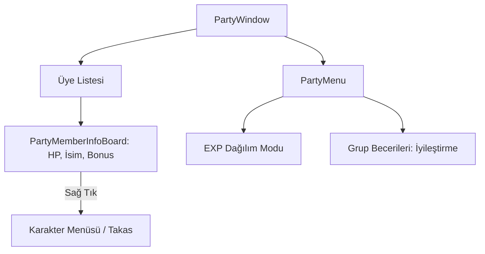

# 🎓 Metin2 Skills: `uiParty.py` (Grup / Party Sistemi)

`uiParty.py`, oyuncuların bir araya gelerek kurduğu Grupların yönetim panelidir. Ekranın solunda beliren üye listesini, can barlarını ve grup bonuslarını yönetir.

---

## 🔍 Neleri Yönetir?

### 1. Üye Bilgi Paneli (`PartyMemberInfoBoard`)
Her bir grup üyesi için bir satır oluşturur. Üyenin ismini, o anki HP durumunu (Yüzde olarak) ve aldığı grup bonuslarını gösterir.
- **Liderlik Bonusları:** Grup liderinin "Liderlik" becerisi seviyesine göre üyelere atadığı rolleri (Saldırıcı, Tanker, İyileştirici vb.) yönetir.

### 2. Grup Menüsü (`PartyMenu`)
Listenin en altındaki küçük butonla açılan yönetim alanıdır.
- **Tecrübe Dağılımı:** EXP'nin "Seviye"ye göre mi yoksa "Eşit" olarak mı dağıtılacağını belirler.
- **Grup Becerileri:** "Herkesi İyileştir" gibi sadece grup içindeyken kullanılabilen özel yetenekleri tetikler.

### 3. Uzaklık Kontrolü (`Link/Unlink`)
Eğer bir üye senden çok uzaklaşırsa veya farklı bir haritaya giderse, ismi grileşir (`Unlink`) ve can barı gizlenir. Tekrar yaklaştığında ise bilgiler güncellenir (`Link`).

---

## 🛠️ Modifikasyon ve Kritik Uyarılar

### ✅ Yeni Grup Rolleri Ekleme:
Eğer sunucunda yeni bir liderlik özelliği (örn: "Kritik Vuruşçu") eklemek istiyorsan, `STATE_NAME_DICT` ve `MEMBER_BUTTON_IMAGE_FILE_NAME_DICT` listelerini güncellemelisin.

### ✅ Grup Üyesi Yanına Gitme (Warp):
Grup liderleri için belirli bir seviyeden sonra aktif olan "Üyeyi Yanına Çek" butonunun yerleşimini ve çalışmasını bu dosya üzerinden kontrol edebilirsin.

### ⚠️ Senkronizasyon Sorunu:
Grup üyelerinin HP barları bazen geç güncellenebilir. Bu, `UpdatePartyMemberInfo` fonksiyonuna gelen verinin hızıyla alakalıdır. Çok hızlı güncellenmesi sunucuya yük bindirebilir.

---

## 🚨 Hata Ayıklama (Debug)

**"Gruptan çıkıyorum ama hala listede görünüyorum" sorunu:**
1.  `ExitParty` fonksiyonunun hem client hem de sunucu taraflı (`net.SendPartyExitPacket`) düzgün tetiklendiğinden emin ol.
2.  `DestroyPartyMemberInfoBoard` fonksiyonunun listeyi temizleyip temizlemediğini kontrol et.

---

## 📉 uiParty.py Yapı Şeması

---

**Sonuç:** `uiParty.py`, oyunun "Ekip Çalışması" motorudur. Zindanlarda ve boss savaşlarında hayatta kalmanın anahtarı buradaki bilgilerin doğruluğudur.
