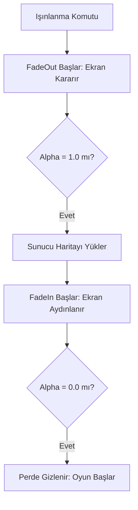

# 🎓 Metin2 Skills: `uiPhaseCurtain.py` (Geçiş Perdesi / Karartma)

`uiPhaseCurtain.py`, oyunda harita değiştirirken veya bir sinematik başlarken ekranın yavaşça kararmasını ve tekrar aydınlanmasını sağlayan "Görsel Perde" sistemini yönetir.

---

## 🔍 Neleri Yönetir?

### 1. Karartma Efekti (`FadeOut`)
Ekranın şeffaftan siyaha doğru yavaşça dönmesini sağlar. Karartma tam siyaha ulaştığında (`alpha = 1.0`), genellikle bir sonraki işlem (örn: ışınlanma) tetiklenir.

### 2. Aydınlanma Efekti (`FadeIn`)
Tam siyah olan ekranın yavaşça şeffaflaşarak oyun dünyasının tekrar görünmesini sağlar.

### 3. Dinamik Ekran Boyutu
Perde her zaman oyuncunun o anki ekran çözünürlüğüne (`GetScreenWidth/Height`) göre kendini yeniden boyutlandırır, böylece hiçbir köşede boşluk kalmaz.

---

## 🛠️ Modifikasyon ve Kritik Uyarılar

### ✅ Geçiş Hızını Ayarlamak:
`self.speed = 0.1` değerini değiştirerek ekranın daha hızlı veya daha yavaş kararmasını sağlayabilirsin. (Örn: 0.05 yaparsan çok daha ağır ve dramatik bir geçiş olur).

### ✅ Renkli Perdeler:
Sadece siyah değil, örneğin bir "Beyaz Perde" (Whiteout) efekti için `grp.GenerateColor` içindeki RGB değerlerini (1.0, 1.0, 1.0) olarak değiştirebilirsin.

### ⚠️ Senkronizasyon:
Eğer `FadeOut` tamamlanmadan sunucu ışınlanmayı bitirirse, ekran aniden açılabilir. Bu yüzden perdenin hızı ile yükleme süresi dengeli olmalıdır.

---

## 🚨 Hata Ayıklama (Debug)

**"Ekran siyah kaldı ama oyun sesleri geliyor" sorunu:**
1.  `FadeIn` fonksiyonunun tetiklenip tetiklenmediğini kontrol et.
2.  `OnUpdate` içindeki `FadeInFlag` değişkeninin `True` olup olmadığını denetle; bazen bir hata perdenin takılmasına neden olabilir.

---

## 📉 uiPhaseCurtain.py İşlem Sırası

---

**Sonuç:** `uiPhaseCurtain.py`, oyunun "Göz Kapaklarıdır". Sahne değişimlerini yumuşatarak oyuncunun görsel konforunu sağlar.
