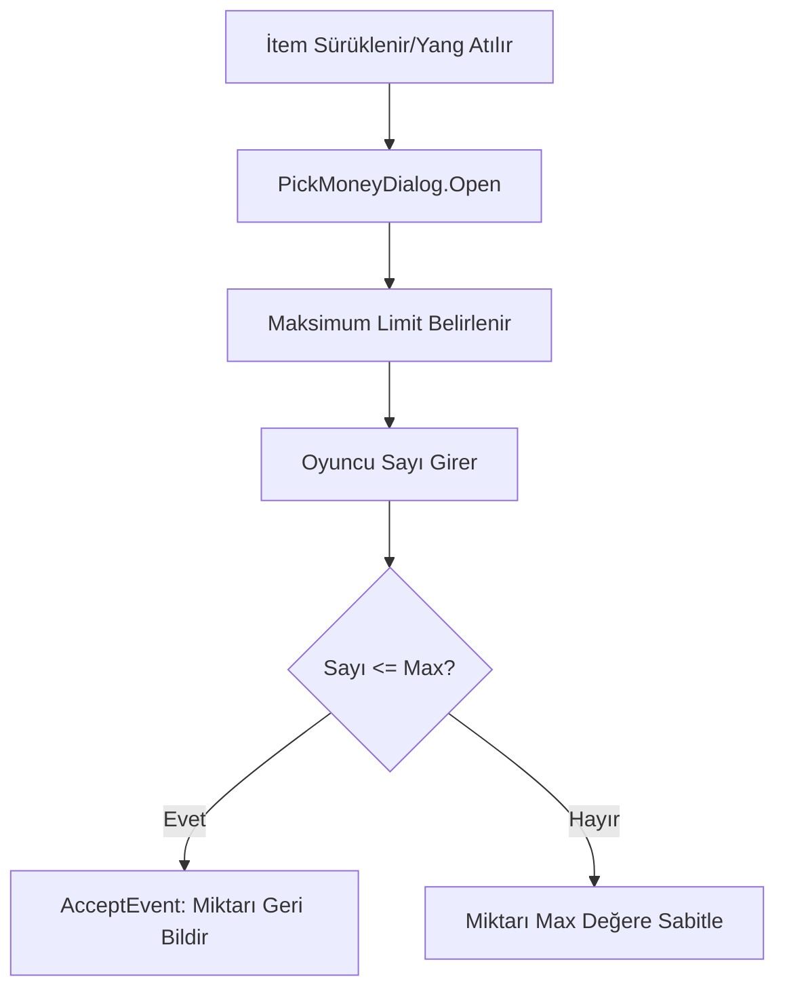

# 🎓 Metin2 Skills: `uiPickMoney.py` (Miktar Belirleme Diyaloğu)

`uiPickMoney.py`, envanterden bir eşyayı ayırırken (Stack splitting) veya yere para atarken açılan "Kaç tane?" veya "Ne kadar?" sorusunu soran küçük kutucuğu yönetir.

---

## 🔍 Neleri Yönetir?

### 1. Maksimum Değer Gösterimi (`maxValueTextLine`)
Oyuncunun elindeki toplam miktarı (örn: " / 200") sağ tarafta göstererek, bunun üzerinde bir sayı girmesini engeller.

### 2. Dinamik Konumlandırma
Pencere açıldığında her zaman sabit bir yerde değil, farenin (Mouse) o anki konumuna yakın bir yerde belirir. Bu, oyuncunun daha az fare hareketi yapmasını sağlar.

### 3. Giriş Doğrulama (`OnAccept`)
Yazılan metnin bir sayı (`isdigit`) olup olmadığını ve girilen sayının eldeki miktardan fazla olup olmadığını kontrol eder.

---

## 🛠️ Modifikasyon ve Kritik Uyarılar

### ✅ Hızlı Miktar Butonları:
Oyuncuların sürekli sayı yazmak zorunda kalmaması için pencereye "Minimum", "Yarı" ve "Maksimum" butonları eklenebilir.

### ✅ Formatlı Sayı Gösterimi:
Yang miktarı girerken sayıların arasına nokta (örn: 1.000.000) koyarak okunabilirliği artıracak bir mantık `uiCommon.py`'deki gibi buraya da entegre edilebilir.

### ⚠️ Negatif Sayı Kontrolü:
Her ne kadar `isdigit` kontrolü olsa da, bazen "copy-paste" ile garip karakterlerin girmesi sistemi bozabilir. Bu yüzden her zaman `min(money, self.maxValue)` kontrolü hayati önem taşır.

---

## 🚨 Hata Ayıklama (Debug)

**"Sayıyı yazıp 'Tamam'a basıyorum ama pencere kapanmıyor" sorunu:**
1.  `SetAcceptEvent` ile bu pencereyi çağıran dosyanın (genellikle `uiInventory.py`) doğru bir fonksiyon bağlayıp bağlamadığını kontrol et.
2.  `isdigit` kontrolü başarısız oluyor olabilir (boşluk veya harf girilmiş olabilir).

---

## 📉 uiPickMoney.py İşlem Akışı

---

**Sonuç:** `uiPickMoney.py`, oyunun "Miktar Terazisidir". Eşya paylaşımında ve para transferlerinde hata yapılmasını önleyen bir güvenlik katmanıdır.
