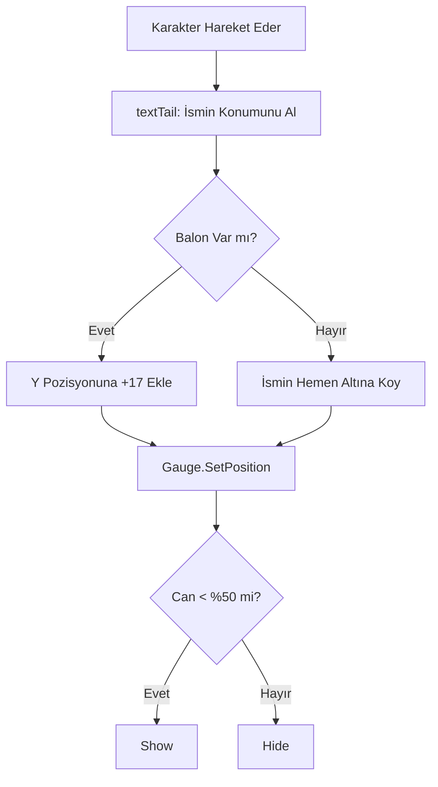

# 🎓 Metin2 Skills: `uiPlayerGauge.py` (Karakter Üstü Can Barı)

`uiPlayerGauge.py`, oyun dünyasında karakterinin tam üzerinde (isminin hemen altında) beliren o küçük kırmızı can barını yönetir.

---

## 🔍 Neleri Yönetir?

### 1. Dinamik Konumlandırma
Karakterin hareket ettikçe barın da onunla birlikte hareket etmesini sağlar. `textTail.GetPosition` fonksiyonunu kullanarak karakterin isminin koordinatlarını alır ve barı tam oraya sabitler.

### 2. Görünürlük Mantığı
Standart Metin2'de bu bar her zaman görünmez.
- **Yarı Can Kuralı:** Sadece canın %50'nin altına düştüğünde otomatik olarak belirir.
- **Konuşma Kontrolü:** Eğer karakterin başında bir konuşma balonu (`isChat`) varsa, can barı balonun altında kalmaması için biraz daha aşağı kaydırılır.

### 3. Sürekli Gösterim (`showAlways`)
Bazı özel ayarlar veya modifikasyonlar ile bu barın canın full olsa bile her zaman görünmesini sağlar.

---

## 🛠️ Modifikasyon ve Kritik Uyarılar

### ✅ SP (Mavi Bar) Ekleme:
Oyuncuların sadece HP'sini değil, SP (Mana) durumlarını da karakterin üzerinde görebilmesi için buraya ikinci bir `ui.Gauge` (mavi renkte) eklenebilir.

### ✅ Renk Değişimi:
Can barının rengini can azaldıkça kırmızıdan koyu kırmızıya veya sarıya çevirecek bir mantık `RefreshGauge` içine eklenebilir.

### ⚠️ FPS ve Performans:
Bu bar her karede (`OnUpdate`) karakterin pozisyonunu kontrol eder. Eğer ekranda çok fazla oyuncu varsa ve hepsinin üzerinde bu bar aktifse, `textTail` sorguları performansı etkileyebilir.

---

## 🚨 Hata Ayıklama (Debug)

**"Canım az ama bar görünmüyor" sorunu:**
1.  `RefreshGauge` içindeki `%50` kontrolünü kontrol et.
2.  `Hide` fonksiyonu barı ekrandan tamamen silmek yerine `-100, -100` koordinatına (ekran dışına) taşır. Eğer koordinat hesaplaması bozulursa bar ekranın dışında kalmış olabilir.

---

## 📉 uiPlayerGauge.py Yerleşim Şeması

---

**Sonuç:** `uiPlayerGauge.py`, karakterin "Sağlık Durumunu" oyun dünyasına yansıtan küçük ama hayati bir göstergedir.
