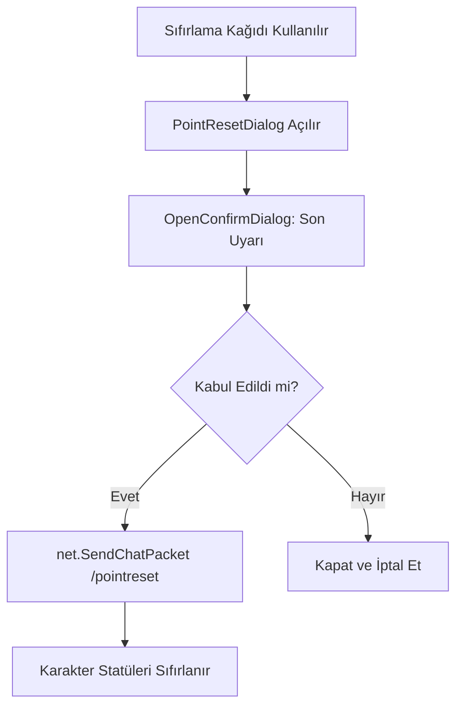

# 🎓 Metin2 Skills: `uiPointReset.py` (Statü/Beceri Sıfırlama Diyaloğu)

`uiPointReset.py`, oyuncunun statü puanlarını (STR, INT vb.) veya becerilerini sıfırlamak için kullandığı eşyalar tetiklendiğinde açılan onay penceresidir.

---

## 🔍 Neleri Yönetir?

### 1. Çift Aşamalı Onay
Oyuncunun yanlışlıkla tüm emeklerini sıfırlamasını önlemek için iki aşamalı bir mantık kullanır.
- **İlk Diyalog:** "Sıfırlamak istediğine emin misin?" sorusunu sorar.
- **İkinci Diyalog (Confirm):** "Bu işlem geri alınamaz, onaylıyor musun?" şeklinde son bir uyarı yapar.

### 2. Paket Gönderimi (`ResetPoint`)
Onay verildiğinde sunucuya `/pointreset` (veya benzeri bir komut) göndererek veritabanındaki statülerin sıfırlanmasını tetikler.

---

## 🛠️ Modifikasyon ve Kritik Uyarılar

### ✅ Tekil Sıfırlama Ekleme:
Sadece tüm statüleri değil, sadece STR veya sadece INT sıfırlamak için farklı butonlar ve komutlar buraya eklenebilir.

### ✅ Maliyet Gösterimi:
Bazı sunucularda sıfırlama işlemi Yang gerektirir. Diyaloğun metin kısmına `localeInfo` üzerinden dinamik bir maliyet yazısı eklenebilir.

### ⚠️ Komut Değişikliği:
Sunucu taraflı komut `/pointreset` yerine farklı bir isimle (örn: `/reset_status`) tanımlandıysa, buradaki fonksiyonun da güncellenmesi şarttır.

---

## 🚨 Hata Ayıklama (Debug)

**"Sıfırla diyorum ama statülerim değişmiyor" sorunu:**
1.  Sunucudaki komut yetkisini kontrol et. Bazı durumlarda bu komut sadece belirli seviyeler arasında çalışabilir.
2.  `ConfirmAcceptButton` olayının (Event) `ResetPoint` fonksiyonuna doğru bağlanıp bağlanmadığını kontrol et.

---

## 📉 uiPointReset.py İşleyiş Şeması

---

**Sonuç:** `uiPointReset.py`, karakterin "Geçmişini Silen" ve yeni bir başlangıç yapmasını sağlayan kritik bir onay kapısıdır.
