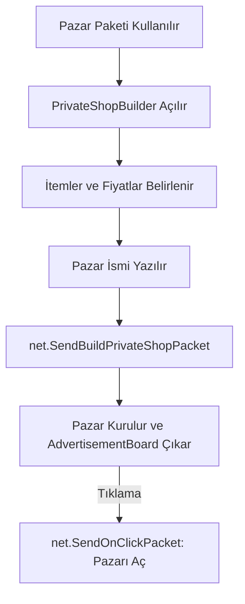

# 🎓 Metin2 Skills: `uiPrivateShopBuilder.py` (Pazar Kurma Sistemi)

`uiPrivateShopBuilder.py`, oyuncuların eşyalarını satmak için kurduğu "Pazar" (Private Shop) arayüzünü ve bu pazarların üzerinde görünen isim levhalarını yönetir.

---

## 🔍 Neleri Yönetir?

### 1. Pazar Kurma Paneli (`PrivateShopBuilder`)
Eşyaları sürükleyip bıraktığın, isim belirlediğin ve fiyat girdiğin ana paneldir. 
- **Fiyat Hafızası:** `g_itemPriceDict` değişkeni ile daha önce bir itemi kaça sattığını hatırlar ve tekrar aynı itemi koyduğunda fiyatı otomatik doldurur.

### 2. Pazar İsim Levhaları (`PrivateShopAdvertisementBoard`)
Kurulu olan tüm pazarların üzerinde yüzen o küçük başlık kutularıdır. Tıklandığında pazarın açılmasını sağlar.

### 3. Paket Gönderimi
Tüm eşyalar ve fiyatlar belirlendikten sonra `net.SendBuildPrivateShopPacket` ile pazarın fiziksel olarak kurulmasını tetikler.

---

## 🛠️ Modifikasyon ve Kritik Uyarılar

### ✅ Çevrimdışı Pazar (Offline Shop):
Eğer oyunun kapalıyken pazarın açık kalmasını istiyorsan, bu dosyaya "Süre Belirleme" ve "Offline Mod" seçeneklerini eklemelisin.

### ✅ Pazar Tasarımı (Skins):
Pazarın sadece bir "Bohça" değil, bir "Çadır" veya "NPC" şeklinde görünmesini sağlayacak görsel seçenekleri buradaki `Open` fonksiyonuna entegre edebilirsin.

### ⚠️ Fiyat Hataları (Dolandırıcılık Önleme):
Oyuncuların yanlışlıkla "0" Yang'a veya çok düşük fiyata item koymasını engellemek için fiyat giriş alanına "Binlik Ayırıcı" (örn: 1.000.000) ve "Onay Kutusu" eklenmesi çok kritiktir.

---

## 🚨 Hata Ayıklama (Debug)

**"Pazar kuruyorum ama isim levhası görünmüyor" sorunu:**
1.  `UpdateADBoard` fonksiyonunun her karede (`OnUpdate`) düzgün çağrıldığından emin ol.
2.  `uiscript/privateshopbuilder.py` dosyasındaki koordinatları kontrol et; bazen levhalar karakterin çok üstünde veya altında kalabilir.

---

## 📉 uiPrivateShopBuilder.py Akış Şeması

---

**Sonuç:** `uiPrivateShopBuilder.py`, oyunun "Ekonomik Ticaret" merkezidir. Oyuncuların kazanç sağladığı en temel arayüzlerden biridir.
