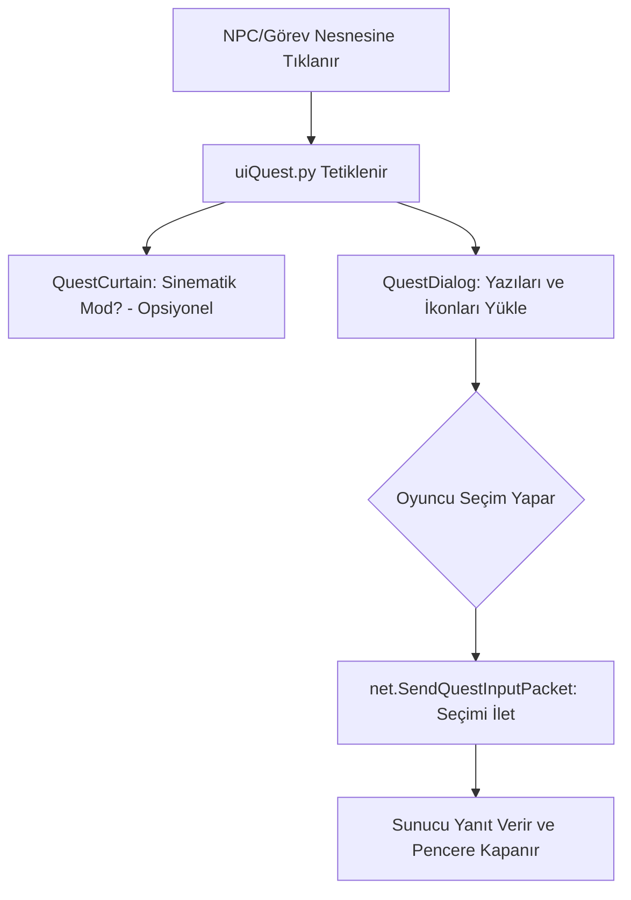

# 🎓 Metin2 Skills: `uiQuest.py` (Görev ve Diyalog Sistemi)

`uiQuest.py`, oyundaki o meşhur "Parşömen" görünümlü görev pencerelerini ve NPC diyaloglarını yöneten dosyadır. Hikayenin oyuncuya aktarıldığı ana kanaldır.

---

## 🔍 Neleri Yönetir?

### 1. Görev Diyalogları (`QuestDialog`)
NPC'lere tıkladığında açılan yazıları, seçenekleri (Butonları) ve ödül olarak gösterilen eşya ikonlarını yönetir.
- **Yazı Efekti:** Yazıların daktilo gibi sırayla gelmesini veya anında görünmesini sağlar.

### 2. Sinematik Siyah Bantlar (`QuestCurtain`)
Önemli bir olay olduğunda veya bir hikaye anlatıldığında ekranın üst ve altından çıkan siyah bantları yönetir. Bu, oyuncuya "şu an bir ara sahnedesin" mesajı verir.

### 3. Seçenek Yönetimi
"Kabul Ediyorum" veya "Reddediyorum" gibi butonlara basıldığında, bu seçimi sunucuya (Lua scriptine) geri bildirir.

---

## 🛠️ Modifikasyon ve Kritik Uyarılar

### ✅ Görev Penceresini Modernleştirmek:
Eski parşömen görüntüsü yerine daha şeffaf veya modern bir kutu tasarımı yapmak istiyorsan, `QUEST_BOARD_IMAGE_DIR` içindeki görselleri ve bu dosyadaki yerleşimleri değiştirmelisin.

### ✅ Hızlı Geçiş Özelliği:
Oyuncuların uzun görev yazılarını beklememesi için fare tıklandığında yazının anında tamamlanmasını sağlayan bir mantık eklenebilir.

### ⚠️ Buton Hataları:
Eğer sunucudaki Lua scripti 5 seçenek sunuyorsa ama `uiQuest.py` sadece 3 tanesini gösterecek şekilde kısıtlanmışsa, oyuncu kritik seçenekleri göremez ve görevde takılı kalabilir.

---

## 🚨 Hata Ayıklama (Debug)

**"Görev penceresi açılıyor ama yazı yazmıyor" sorunu:**
1.  Sunucu taraflı Lua scriptinde bir hata olup olmadığını kontrol et.
2.  `event.GetQuestIndex()` fonksiyonunun doğru çalışıp çalışmadığına bak.

---

## 📉 uiQuest.py İşleyiş Şeması

---

**Sonuç:** `uiQuest.py`, oyunun "Anlatıcısıdır". Oyuncunun dünya ile kurduğu sözel iletişimin ve görev takibinin merkezidir.
