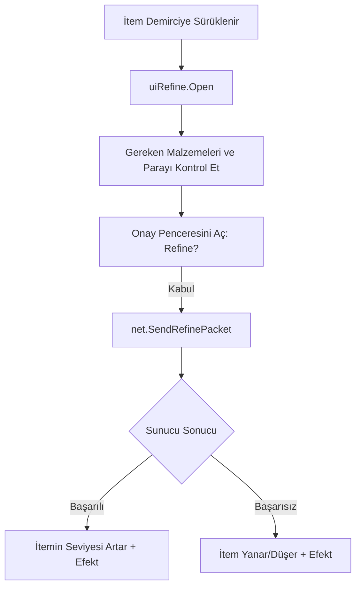

# 🎓 Metin2 Skills: `uiRefine.py` (Demirci / Eşya Yükseltme)

`uiRefine.py`, Demirci veya Büyülü Metal gibi eşyalarla bir silahı/zırhı yükseltmeye (Artı basmaya) çalıştığında açılan penceredir. Oyunun en heyecanlı ve riskli sistemlerinden birini yönetir.

---

## 🔍 Neleri Yönetir?

### 1. Yükseltme Penceresi (`RefineDialog`)
İtemin bir sonraki seviyesindeki özelliklerini, basım için gereken malzemeleri (İnci, İstiridye vb.) ve maliyetini gösterir.

### 2. Onay Penceresi (`dlgQuestion`)
"Bu işlem eşyayı yok edebilir, devam etmek istiyor musun?" uyarısını göstererek oyuncuyu son bir kez uyarır.

### 3. Başarı Şansı Gösterimi
Kod içinde `upgradeSuccessPercentage` gibi listeler bulunur. Bazı sunucularda bu oranların ekranda görünmesini sağlar.

---

## 🛠️ Modifikasyon ve Kritik Uyarılar

### ✅ Başarı Şansını Ekranda Göstermek:
Normal Metin2'de şans oranı görünmez. `self.successPercentage.Show()` satırını aktif ederek ve sunucudan gelen oranları buraya bağlayarak oyunculara yüzde kaç şansları olduğunu gösterebilirsin.

### ✅ Hızlı Artı Basma Sistemi:
Eğer oyuncunun malzemesi varsa, pencereyi kapatmadan "Tekrar Dene" butonu ekleyerek saniyeler içinde +9'a deneme yapmasını sağlayacak bir sistem kurabilirsin.

### ⚠️ Yanıltıcı Oranlar:
Buradaki yüzde oranları (`99, 66, 33...`) sadece görselliktir. Asıl şans oranı sunucu tarafındaki `item_proto` içindedir. Buradaki rakamları değiştirmek basma şansını artırmaz, sadece oyuncuyu kandırır.

---

## 🚨 Hata Ayıklama (Debug)

**"Malzemelerim tam ama 'Kabul' butonu çalışmıyor" sorunu:**
1.  `net.SendRefinePacket` fonksiyonunun gönderdiği parametrelerin (item pozisyonu, metal tipi vb.) doğruluğunu kontrol et.
2.  `refinedialog.py` (UIScript) dosyasındaki buton ve metin alanlarının isimlerini kontrol et.

---

## 📉 uiRefine.py İşleyiş Şeması

---

**Sonuç:** `uiRefine.py`, oyunun "Kader Anı"dır. Buradaki görsel geri bildirimler (başarı/başarısızlık efektleri) oyuncunun adrenalin seviyesini belirler.
