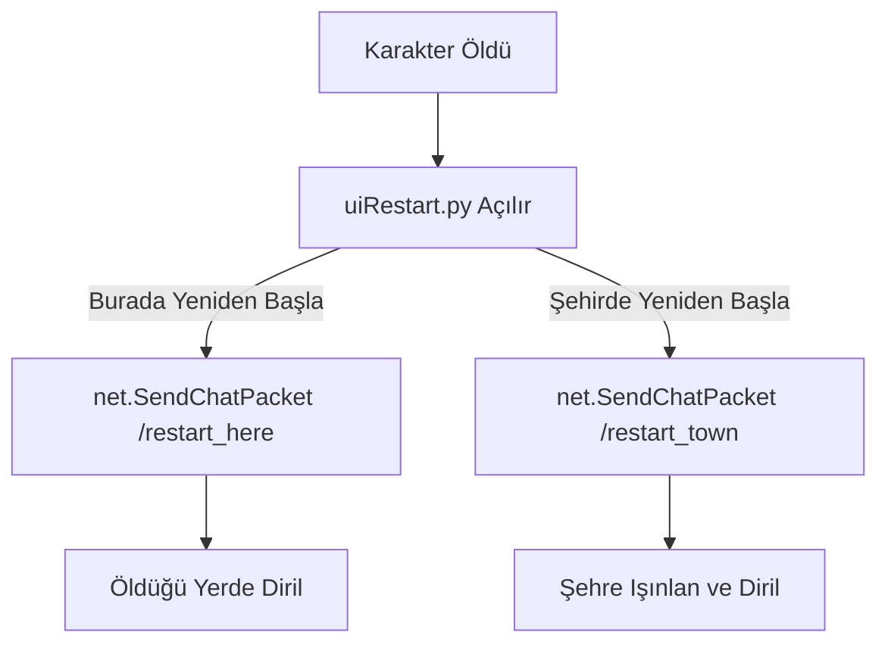

# 🎓 Metin2 Skills: `uiRestart.py` (Yeniden Başlama / Ölüm Ekranı)

`uiRestart.py`, karakterin canı 0'a düştüğünde ekrana gelen "Yeniden Başla" penceresini yönetir. Oyuncunun maceraya nereden devam edeceğine karar verdiği yerdir.

---

## 🔍 Neleri Yönetir?

### 1. Burada Yeniden Başla (`RestartHere`)
Karakterin öldüğü noktada, canı ve büyü gücü belirli bir oranda dolarak dirilmesini sağlar.
- **Komut:** Arka planda `/restart_here` komutunu sunucuya gönderir.

### 2. Şehirde Yeniden Başla (`RestartTown`)
Karakteri o haritanın başlangıç noktasına (Şehir merkezine) ışınlayarak full canla diriltir.
- **Komut:** Arka planda `/restart_town` komutunu sunucuya gönderir.

---

## 🛠️ Modifikasyon ve Kritik Uyarılar

### ✅ Otomatik Dirilme Sistemi:
Eğer oyuncu 3 dakika boyunca hiçbir butona basmazsa, oyunun onu otomatik olarak şehre göndermesini sağlayacak bir `OnUpdate` sayacı ekleyebilirsin.

### ✅ Ejderha Parası/Madalyonu ile Dirilme:
Pencereye yeni bir buton ekleyerek, oyuncunun öldüğü yerde %100 canla ve beklemeden (bazı haritalardaki süreyi aşarak) dirilmesini sağlayacak özel bir sistem kurabilirsin.

### ⚠️ Engelleyici Tuşlar:
Bu pencere açıkken `OnPressExitKey` ve `OnPressEscapeKey` fonksiyonları `True` döndürür; yani oyuncu ESC'ye basarak bu pencereyi kapatamaz. Bu, oyuncunun ölü modda kalıp hile yapmasını önlemek için bir güvenlik önlemidir.

---

## 🚨 Hata Ayıklama (Debug)

**"Ölüyorum ama butonlar çıkmıyor" veya "Tıklıyorum ama dirilmiyor" sorunu:**
1.  Sunucu tarafındaki (Server) `restart` komutlarının çalışıp çalışmadığını kontrol et.
2.  `restartdialog.py` (UIScript) dosyasında buton isimlerinin doğru tanımlandığından emin ol.

---

## 📉 uiRestart.py Karar Şeması

---

**Sonuç:** `uiRestart.py`, oyunun "Devam Et" butonudur. Buradaki süreler ve seçenekler, oyunun zorluk seviyesini ve heyecanını dengeler.
