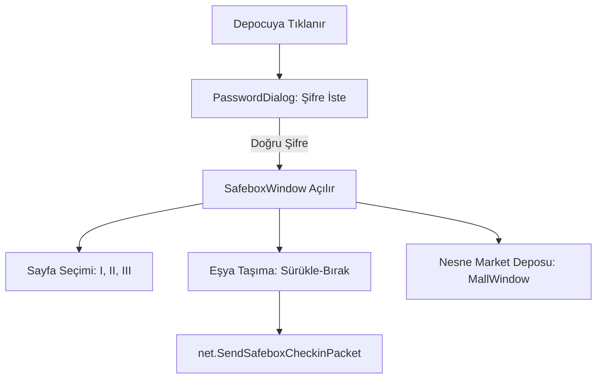

# 🎓 Metin2 Skills: `uiSafebox.py` (Depo ve Nesne Market Deposu)

`uiSafebox.py`, oyuncunun eşyalarını sakladığı "Depo" ve satın aldığı ürünlerin geldiği "Nesne Market Deposu" sistemlerini yönetir. Şifreleme ve sayfa yönetimi bu dosyanın ana görevidir.

---

## 🔍 Neleri Yönetir?

### 1. Depo Şifreleme (`PasswordDialog`)
Depoyu açmadan önce gereken 6 haneli şifrenin girilmesini ve doğrulanmasını sağlar.
- **Komut:** `/safebox_password <şifre>` komutunu sunucuya gönderir.

### 2. Eşya ve Para Saklama
- **İtem Transferi:** Envanterden depoya veya depodan envantere eşya taşımayı (`net.SendSafeboxCheckinPacket`) yönetir.
- **Para Transferi:** Depoya Yang yatırma veya çekme işlemlerini gerçekleştirir.

### 3. Depo Sayfaları (`SelectPage`)
Deponun I, II ve III. sayfaları arasında geçiş yapmanı sağlar.

### 4. Nesne Market Deposu (`MallWindow`)
Sadece Nesne Market'ten alınan eşyaların göründüğü özel bir depo alanıdır. Buraya dışarıdan eşya koyulamaz, sadece eşya alınabilir.

---

## 🛠️ Modifikasyon ve Kritik Uyarılar

### ✅ Depo Sayfa Sayısını Artırmak:
Daha fazla depolama alanı sunmak için 3 olan sayfa limitini artırabilirsin. Bunun için `pageButtonList` döngülerini ve `SetTableSize` fonksiyonunu güncellemen gerekir.

### ✅ Uzaktan Depo Açma:
Normalde Depocu NPC'sine gitmek gerekir. Ancak VIP oyuncular veya özel sistemler için `game.py` üzerinden bir tuşa basıldığında `/safebox_open` (veya benzeri bir komut) göndererek deponun her yerden açılmasını sağlayabilirsin.

### ⚠️ Şifre Güvenliği:
Şifre giriş pencerelerinde `passwordValue.SetText("")` komutu ile her açılışta kutunun temizlenmesi güvenliğin en önemli parçasıdır.

---

## 🚨 Hata Ayıklama (Debug)

**"Depoya item koyamıyorum" veya "Yanlış şifre diyor" sorunu:**
1.  `net.SendSafeboxCheckinPacket` paketinin sunucuya ulaşıp ulaşmadığına bak.
2.  Depo şifresini değiştirirken `newPassword` ve `newPasswordCheck` alanlarının birbiriyle uyuşup uyuşmadığını kontrol eden mantığı incele.

---

## 📉 uiSafebox.py Akış Şeması

---

**Sonuç:** `uiSafebox.py`, oyuncunun birikimlerini koruyan "Bankadır". Buradaki şifreleme ve taşıma mantığı, eşya güvenliği için en kritik noktadır.
