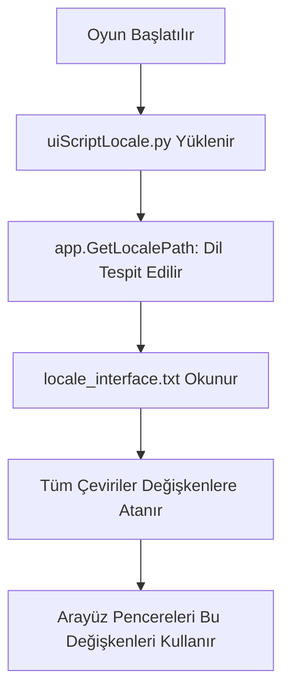

# 🎓 Metin2 Skills: `uiScriptLocale.py` (Dil ve Arayüz Yerelleştirme)

`uiScriptLocale.py`, oyunun farklı dillerde (Türkçe, İngilizce, Almanca vb.) nasıl görüneceğini, hangi klasörden hangi yazıları çekeceğini belirleyen "Tercüman" dosyasıdır.

---

## 🔍 Neleri Yönetir?

### 1. Arayüz Dosya Yolları (`LOCALE_UISCRIPT_PATH`)
Oyunun `UIScript` (arayüz tasarımı) dosyalarını hangi klasörden okuyacağını belirler. Örneğin Türkçe bir oyunda bu yol `locale/tr/ui/` olur.

### 2. Dil Dosyası Yükleyici (`LoadLocaleFile`)
`locale_interface.txt` dosyasındaki tüm çevirileri okur ve bunları Python içinde kullanılabilir değişkenlere dönüştürür.
- **Örnek:** Dosyada `INVENTORY_TITLE [TAB] Envanter` yazıyorsa, kod içinde `uiScriptLocale.INVENTORY_TITLE` yazdığında ekrana "Envanter" gelir.

### 3. Tanıtım Metinleri (Descriptions)
Karakter oluşturma ekranındaki Savaşçı, Ninja gibi sınıfların açıklamalarını ve krallıkların (Shinsoo, Chunjo, Jinno) hikayelerini içeren `.txt` dosyalarının yollarını tutar.

---

## 🛠️ Modifikasyon ve Kritik Uyarılar

### ✅ Çoklu Dil Desteği Ekleme:
Eğer sunucuna yeni bir dil (örn: İspanyolca) eklemek istiyorsan, `app.GetLocaleServiceName()` kontrolüne yeni bir `elif` ekleyerek o dile ait klasör yollarını buraya tanımlamalısın.

### ✅ Arayüz Klasörünü Değiştirmek:
Tüm arayüzü (UIScript) baştan aşağı yenilediysen ve eski dosyaları bozmadan test etmek istiyorsan, `LOCALE_UISCRIPT_PATH` değerini kendi test klasörüne yönlendirebilirsin.

### ⚠️ Dosya Eksikliği:
Eğer `locale_interface.txt` dosyası okunamazsa veya içindeki bir anahtar kelime eksikse, oyun açılırken "LoadUIScriptLocaleError" vererek tamamen kapanır (`app.Abort`).

---

## 🚨 Hata Ayıklama (Debug)

**"Oyunda butonların üzerinde garip yazılar (örn: UI_RESTART_BUTTON) çıkıyor" sorunu:**
1.  `uiScriptLocale.py` dosyasının o yazının anahtarını `locale_interface.txt` içinde bulamadığını gösterir.
2.  `locale_interface.txt` dosyasını açıp eksik olan kelimeyi eklemelisin.

---

## 📉 uiScriptLocale.py İşlem Akışı

---

**Sonuç:** `uiScriptLocale.py`, oyunun "Dünya ile konuşan ağzıdır". Buradaki ayarlar, oyunun hangi bölgede ve hangi dilde çalışacağını belirler.
