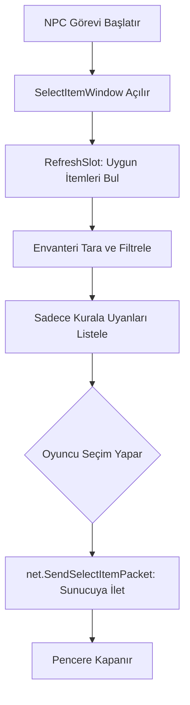

# 🎓 Metin2 Skills: `uiSelectItem.py` (Eşya Seçme Penceresi)

`uiSelectItem.py`, bir NPC veya görev senden envanterinden bir eşya seçmeni istediğinde (örn: "Bana bir Metin Taşı ver") açılan seçim arayüzünü yönetir.

---

## 🔍 Neleri Yönetir?

### 1. Envanter Filtreleme (`RefreshSlot`)
Bu pencere tüm envanteri değil, sadece o anki göreve uygun olan eşyaları listeler. 
- **Örnek Mantık:** Mevcut kodda sadece **Metin Taşlarını** (`item.IsMetin`) ve seviyesi düşük olanları filtreler.

### 2. Dinamik Pencere Boyutu (`SetTableSize`)
Ekranda listelenecek eşya sayısına göre pencerenin yüksekliğini otomatik olarak ayarlar. Az eşya varsa küçük, çok eşya varsa daha büyük bir tablo oluşturur.

### 3. Seçim ve Bildirim (`SelectItemSlot`)
Oyuncu bir eşyaya tıkladığında, o eşyanın gerçek envanter numarasını (`inventoryPos`) belirler ve sunucuya `net.SendSelectItemPacket` ile bildirir.

---

## 🛠️ Modifikasyon ve Kritik Uyarılar

### ✅ Yeni Filtreler Ekleme:
Görevin türüne göre (örn: "Sadece +9 kılıçları göster") filtreleme mantığını `RefreshSlot` fonksiyonu içinde değiştirebilirsin.

### ✅ Onay Penceresi:
Değerli bir eşyanın yanlışlıkla seçilip göreve verilmesini önlemek için tıklama anında bir `QuestionDialog` (onay kutusu) açılması güvenliği artıracaktır.

### ⚠️ Slot Senkronizasyonu:
`inventorySlotPosDict` sözlüğü, bu penceredeki 1. slotun aslında envanterdeki 45. slot olduğunu hatırlar. Eğer bu eşleşme yanlış yapılırsa oyuncu istediği itemi değil, bambaşka bir itemi NPC'ye verebilir.

---

## 🚨 Hata Ayıklama (Debug)

**"Envanterimde item var ama seçim listesinde görünmüyor" sorunu:**
1.  `RefreshSlot` içindeki `if not item.IsMetin(itemVNum): continue` gibi filtreleme satırlarını kontrol et. Eşyanın tipi veya seviyesi filtreye takılıyor olabilir.
2.  `inventorySlotPosDict` içindeki maksimum limit olan 54'ü kontrol et.

---

## 📉 uiSelectItem.py İşlem Haritası

---

**Sonuç:** `uiSelectItem.py`, oyuncunun envanteri ile görevler arasındaki "Seçici Köprü"dür. Doğru eşyanın doğru yere teslim edilmesini garanti eder.
