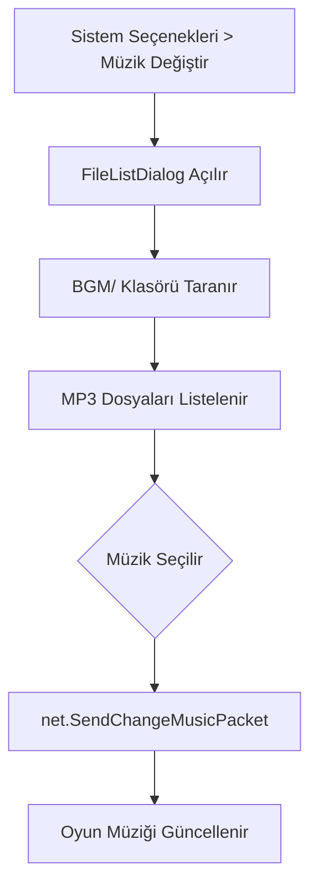

# 🎓 Metin2 Skills: `uiSelectMusic.py` (Müzik Seçim Paneli)

`uiSelectMusic.py`, oyunun `BGM` (Background Music) klasöründeki müzik dosyalarını listeleyen ve oyuncunun arka planda çalacak müziği seçmesini sağlayan paneldir.

---

## 🔍 Neleri Yönetir?

### 1. BGM Klasör Taraması (`__AppendFileList`)
Oyunun kurulu olduğu dizindeki `BGM/` klasörünü tarar ve içindeki tüm `.mp3` dosyalarını bulup listeye ekler.

### 2. Liste Öğesi (`Item`)
Her bir müzik dosyasını listede bir satır olarak oluşturur. Dosya isminin çok uzun olması durumunda (`FILE_NAME_LEN = 20`) ismi kısaltarak arayüzün bozulmasını engeller.

### 3. Varsayılan Müzik (`DEFAULT_THEMA`)
Listenin en başında her zaman oyunun orijinal ana müziği (örn: `enter_the_east.mp3`) bulunur.

---

## 🛠️ Modifikasyon ve Kritik Uyarılar

### ✅ Yeni Müzikler Ekleme:
Oyuncuların kendi müziklerini dinleyebilmesi için tek yapmaları gereken, istedikleri `.mp3` dosyasını `BGM/` klasörüne atmaktır. Bu dosya otomatik olarak o yeni dosyayı görüp listeye ekleyecektir.

### ✅ Ön Dinleme Özelliği:
Müziği seçip "Tamam"a basmadan önce, listede üzerine tıklandığı anda müziğin çalmaya başlamasını sağlayacak bir ön izleme mantığı eklenebilir.

### ⚠️ Dosya İsmi Uzunluğu:
`FILE_NAME_LEN` değeri çok küçükse müziklerin ne olduğu anlaşılmayabilir. Modern geniş ekranlar için bu değer artırılabilir.

---

## 🚨 Hata Ayıklama (Debug)

**"Müzik listesi boş görünüyor" sorunu:**
1.  Oyunun ana klasöründe `BGM` adında bir klasör olup olmadığını kontrol et.
2.  Klasörün içindeki dosyaların uzantısının `.mp3` (küçük harf) olduğundan emin ol.

---

## 📉 uiSelectMusic.py İşleyiş Şeması

---

**Sonuç:** `uiSelectMusic.py`, oyunun "Radyosu"dur. Oyuncunun oyun atmosferini kendi zevkine göre şekillendirmesine olanak tanır.
