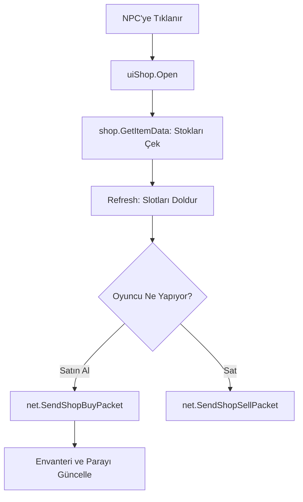

# 🎓 Metin2 Skills: `uiShop.py` (NPC Market Sistemi)

`uiShop.py`, oyundaki satıcılarla (Zırhçı, Silahçı, Market vb.) yapılan alışverişlerin arayüzünü ve mantığını yönetir. İtem satın alma ve satma işlemlerinin merkezidir.

---

## 🔍 Neleri Yönetir?

### 1. Market Stok Yenileme (`Refresh`)
Satıcının sahip olduğu eşyaları, miktarlarını ve fiyatlarını `shop` modülünden alarak ekrandaki slotlara dizer.

### 2. Satın Alma ve Satma Modları
Oyuncu "Satın Al" veya "Sat" butonuna bastığında arayüzün davranışını değiştirir.
- **Satın Al:** Marketteki eşyaya tıklandığında `net.SendShopBuyPacket` gönderir.
- **Sat:** Envanterdeki eşyayı markete sürüklediğinde veya tıkladığında `net.SendShopSellPacket` gönderir.

### 3. Çoklu Sekme Desteği (Tabs)
Bazı satıcıların birden fazla sayfası (örn: Savaşçı Zırhları, Ninja Zırhları) olmasını sağlar.

---

## 🛠️ Modifikasyon ve Kritik Uyarılar

### ✅ Çoklu Satın Alma Ekleme:
Normalde her tıklama 1 adet (veya paketteki miktar kadar) satın alır. Oyuncuların tek seferde 200 adet iksir alabilmesi için buraya bir miktar giriş penceresi (`uiCommon.InputDialog`) ekleyebilirsin.

### ✅ Yanlışlıkla İtem Satmayı Engelleme:
Değerli bir itemi (+7 ve üzeri veya efsunlu) satarken oyuncuya "Emin misiniz?" diye soran bir onay penceresi (`questionDialog`) eklemek, oyuncu memnuniyetini artıran bir modifikasyondur.

### ⚠️ Fiyat Hataları:
Market fiyatları sunucu taraflıdır (MySQL). Ancak istemci tarafındaki `uiShop.py` bu fiyatları doğru göstermezse, oyuncu 1000 Yang sandığı bir iteme 10.000 Yang ödeyebilir ve bu durum kafa karışıklığına yol açar.

---

## 🚨 Hata Ayıklama (Debug)

**"Markete tıklıyorum ama eşyalar görünmüyor" sorunu:**
1.  `shop.GetItemID` fonksiyonunun doğru veri çekip çekmediğine bak.
2.  Eğer `shopdialog.py` (UIScript) içindeki `ItemSlot` tanımlaması hatalıysa eşyalar havada asılı kalabilir veya hiç görünmeyebilir.

---

## 📉 uiShop.py İşlem Şeması

---

**Sonuç:** `uiShop.py`, oyunun ekonomisinin döndüğü arayüzdür. Buradaki kullanım kolaylığı, oyuncunun ticaret hızını ve keyfini belirler.
