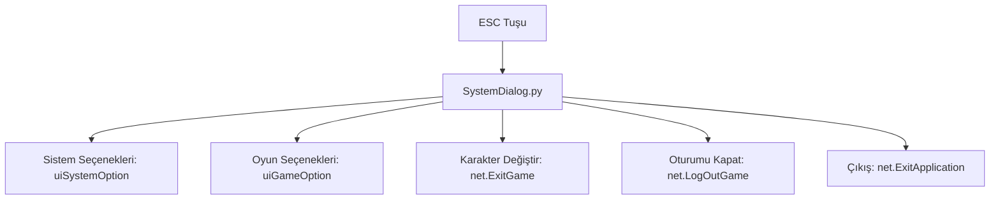

# 🎓 Metin2 Skills: `uiSystem.py` (Sistem Menüsü / ESC)

`uiSystem.py`, klavyeden ESC tuşuna bastığında açılan, oyunun ayarlarını yapmanı veya oyundan çıkmanı sağlayan "Ana Menü"dür.

---

## 🔍 Neleri Yönetir?

### 1. Oyun ve Sistem Seçenekleri
Görüntü/Ses ayarları (`uiSystemOption`) ve Oyun içi tercihler (`uiGameOption`) pencerelerini açar.

### 2. Çıkış ve Karakter Değiştirme
- **Çıkış:** Oyunu tamamen kapatır (`net.ExitApplication`).
- **Oturumu Kapat:** Login ekranına döner (`net.LogOutGame`).
- **Karakter Değiştir:** Karakter seçme ekranına döner (`net.ExitGame`).

### 3. Nesne Market Butonu
`constInfo.IN_GAME_SHOP_ENABLE` aktifse, oyun içinden marketi açmanı sağlayan butonu yönetir.

---

## 🛠️ Modifikasyon ve Kritik Uyarılar

### ✅ Menüye Yeni Butonlar Eklemek:
Eğer oyuncuların ESC menüsünden "Discord" adresine gitmesini veya "Hızlı Kanal Değiştirme" yapmasını istiyorsan, buraya yeni butonlar ve bunlara bağlı fonksiyonlar ekleyebilirsin.

### ✅ Nesne Market Entegrasyonu:
`mall_button` kısmını düzenleyerek marketi web sitesi üzerinden mi yoksa oyun içi bir pencere olarak mı açacağına karar verebilirsin.

### ⚠️ Yanlış Çıkış Fonksiyonu:
`net.ExitGame` ile `net.ExitApplication` fonksiyonlarını karıştırırsan, oyuncu sadece karakter değiştirmek istediğinde oyun tamamen kapanabilir.

---

## 🚨 Hata Ayıklama (Debug)

**"ESC tuşuna basıyorum ama menü gelmiyor" sorunu:**
1.  `game.py` içindeki ESC tuşu yakalayıcısını kontrol et.
2.  Eğer `SystemDialog.py` (UIScript) dosyası bulunamazsa veya içinde bir hata varsa menü yüklenemez.

---

## 📉 uiSystem.py Buton Haritası

---

**Sonuç:** `uiSystem.py`, oyuncunun oyunla olan teknik bağını yöneten kontrol merkezidir. Buradaki düzenlemeler, oyuncunun oyundan ayrılma veya ayar yapma sürecini hızlandırır.
