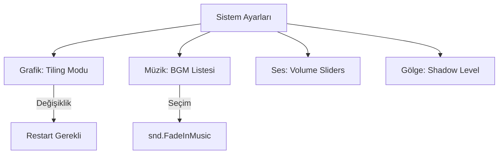

# 🎓 Metin2 Skills: `uiSystemOption.py` (Sistem Grafik ve Ses Ayarları)

`uiSystemOption.py`, oyunun teknik motoruna (Grafik işleme, Ses ve Müzik dosyaları) doğrudan müdahale eden ayarlar panelidir. Oyunun performansını ve atmosferini buradan kontrol ederiz.

---

## 🔍 Neleri Yönetir?

### 1. Grafik İşleme Modu (Tiling)
Oyunun grafiklerini CPU (İşlemci) veya GPU (Ekran Kartı) üzerinden işlemesini sağlar. 
- **Kritik Bilgi:** Bu ayar değiştirildiğinde oyunun yeniden başlatılması gerekir (`net.ExitGame`).

### 2. Müzik Değiştirme (`bgm_button`)
Oyunun `BGM` klasöründeki müzik dosyalarını listeler ve oyuncunun istediği müziği arka planda çalmasını sağlar.

### 3. Gölge Kalitesi (`shadow_bar`)
Karakter ve nesne gölgelerinin detay seviyesini (0 ile 5 arası) ayarlar. Düşük sistemlerde performansı artırmak için buradan kapatılır.

### 4. Ses Kontrolü
Hem arka plan müziğinin hem de vuruş/yürüme gibi efekt seslerinin seviyesini `systemSetting` üzerinden günceller.

---

## 🛠️ Modifikasyon ve Kritik Uyarılar

### ✅ Yeni Grafik Ayarları Ekleme:
Modern clientlerde bulunan "Görüş Mesafesi", "FPS Limiti" veya "HD Doku" gibi seçenekleri buradaki slider veya buton mantığını kopyalayarak ekleyebilirsin.

### ✅ Otomatik Performans Modu:
Oyun kasmaya başladığında (FPS düştüğünde) gölgeleri ve sisi otomatik olarak optimize edecek bir "Düşük Profil" butonu buraya entegre edilebilir.

### ⚠️ Müzik Dosyası Uzunluğu:
`MUSIC_FILENAME_MAX_LEN = 25`. Eğer seçilen müzik dosyasının ismi çok uzunsa arayüzde düzgün görünmeyebilir veya sistemin hata vermesine neden olabilir.

---

## 🚨 Hata Ayıklama (Debug)

**"Müziği değiştiriyorum ama ses gelmiyor" sorunu:**
1.  `BGM` klasöründe ilgili dosyanın olup olmadığını kontrol et.
2.  `snd.FadeInMusic` fonksiyonunun dosya yolunu doğru alıp almadığına bak.

---

## 📉 uiSystemOption.py Bileşen Şeması

---

**Sonuç:** `uiSystemOption.py`, oyunun "Donanım" ile olan köprüsüdür. Doğru yapılandırılmış bir sistem paneli, oyuncunun en düşük PC'de bile akıcı oynamasını sağlar.
