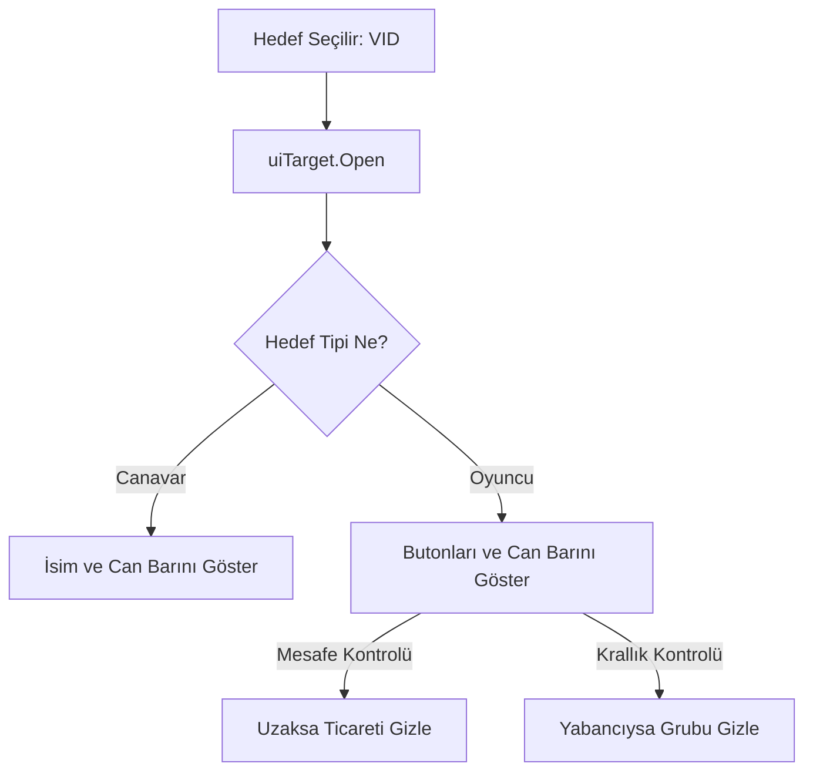

# 🎓 Metin2 Skills: `uiTarget.py` (Hedef Bilgi Paneli)

`uiTarget.py`, bir canavarı veya oyuncuyu seçtiğinde ekranın üstünde beliren, onun canını ve onunla yapabileceğin etkileşimleri (Ticaret, VS, Fısıltı) gösteren paneldir.

---

## 🔍 Neleri Yönetir?

### 1. Hedef Can Göstergesi (HP Gauge)
Seçili hedefin can yüzdesini kırmızı bir bar olarak gösterir.
- **İpucu:** Hedefin isminin yanında "Lv. 50" veya "(Patron)" gibi bilgilerin yazılmasını sağlayan mantık buradadır.

### 2. Etkileşim Butonları
Hedef bir oyuncuysa; Fısıltı, Ticaret, Arkadaş Ekle, Grup Daveti gibi butonları dinamik olarak sıralar.
- **Mesafe Kontrolü:** `EXCHANGE_LIMIT_RANGE = 3000`. Eğer oyuncu çok uzaktaysa "Ticaret" butonu otomatik olarak gizlenir.

### 3. Krallık Kısıtlaması
Farklı krallıktaki bir oyuncuyu seçtiğinde bazı butonların (Grup, Arkadaşlık vb.) gizlenmesini sağlar.

---

## 🛠️ Modifikasyon ve Kritik Uyarılar

### ✅ Yeni Bir Buton Eklemek:
Örneğin bir "Profil Görüntüle" butonu eklemek istiyorsan, `BUTTON_NAME_LIST` içine ismini ekleyip, aşağıda bu buton tıklandığında ne olacağını (`net.SendChatPacket` veya yeni bir fonksiyon) belirtmelisin.

### ✅ Hedefin Canını Sayısal Göstermek:
Normalde sadece bar görünür. Eğer sayısal HP (örn: %85 veya 1500/2000) göstermek istiyorsan, `hpGauge` üzerine bir `TextLine` ekleyip `SetHP` fonksiyonunda bu metni güncellemelisin.

### ⚠️ Buton Çakışmaları:
`__ArrangeButtonPosition` fonksiyonu butonları yan yana dizer. Çok fazla buton eklersen ekranın dışına taşabilir veya birbirinin üzerine binebilirler.

---

## 🚨 Hata Ayıklama (Debug)

**"Birini seçiyorum ama üstte bar çıkmıyor" sorunu:**
1.  `Open` fonksiyonu içindeki `vid` kontrolüne bak.
2.  Eğer hedef başka krallıktansa ve `GET_VIEW_OTHER_EMPIRE_PLAYER_TARGET_BOARD` kapalıysa bar hiç görünmez.

---

## 📉 uiTarget.py İşleyiş Şeması

---

**Sonuç:** `uiTarget.py`, oyuncunun çevresiyle kurduğu "Hızlı Etkileşim" köprüsüdür. Buradaki butonların düzeni ve hızı, oyunun akıcılığını (Flow) etkiler.
