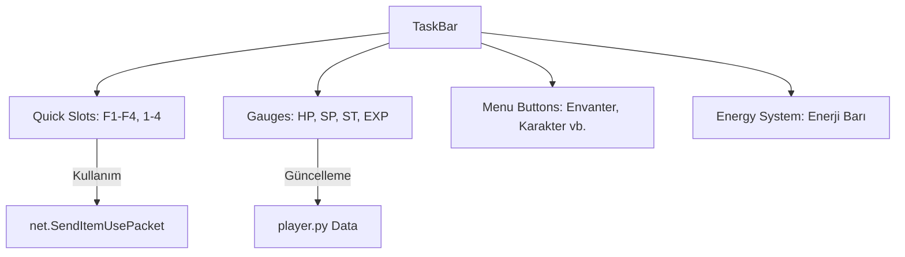

# 🎓 Metin2 Skills: `uiTaskBar.py` (Görev Çubuğu ve HUD)

`uiTaskBar.py`, oyunun en altındaki barın (HP/SP çubukları, Hızlı Slotlar, Menü Butonları) beynidir. Oyuncunun hayatta kalma durumunu anlık olarak gördüğü yerdir.

---

## 🔍 Neleri Yönetir?

### 1. HP, SP ve Dayanıklılık (Stamina) Çubukları
Karakterin can, büyü ve koşma enerjisini görselleştirir. 
- **İşleyiş:** `player` modülünden gelen anlık verileri alır ve çubukların uzunluğunu (`SetPercentage`) günceller.

### 2. Tecrübe (EXP) Küreleri
Metin2'nin klasik 4 küreli tecrübe sistemini yönetir. Her küre dolduğunda görsel olarak parlamasını sağlar.

### 3. Fare Ayarları (`mouse.cfg`)
Farenin sol ve sağ tuşunun ne yapacağını (Saldır veya Hareket Et) hatırlar ve bu bilgiyi `mouse.cfg` dosyasına kaydeder.

### 4. Enerji Sistemi (`EnergyBar`)
Oyuna sonradan eklenen "Enerji Kristali" gibi sistemlerin barını ve süresini takip eder.

---

## 🛠️ Modifikasyon ve Kritik Uyarılar

### ✅ Yeni Bir Bar Ekleme:
Örneğin bir "Sıralama Puanı" veya "Savaş Bileti" barı eklemek istiyorsan, `EnergyBar` sınıfını kopyalayarak kendi barını yaratabilirsin.

### ✅ Hızlı Slot Sayısını Artırmak:
Alttaki barın (QuickSlot) 8 olan slot sayısını artırmak için hem `TaskBar.py` (UIScript) dosyasını hem de bu dosyadaki slot yenileme döngülerini güncellemelisin.

### ⚠️ Fare Ayarı Hataları:
`mouse.cfg` dosyası bozulursa veya yazılamazsa oyun açılırken `RuntimeError` verebilir. Bu dosyadaki `LoadMouseButtonSettings` fonksiyonu bu yüzden hassastır.

---

## 🚨 Hata Ayıklama (Debug)

**"Canım azaldığı halde kırmızı bar düşmüyor" sorunu:**
1.  `SetHP` fonksiyonunun `player.GetStatus(player.HP)` değerini doğru alıp almadığını kontrol et.
2.  Eğer bar görseli (`.sub` veya `.tga` dosyası) bozuksa, kod çalışsa bile ekranda değişim görünmeyebilir.

---

## 📉 uiTaskBar.py Bileşen Şeması

---

**Sonuç:** `uiTaskBar.py`, oyuncunun kontrol merkezidir. Buradaki bir hata, oyuncunun canının kaç kaldığını görememesine veya iksir kullanamamasına yol açar.
