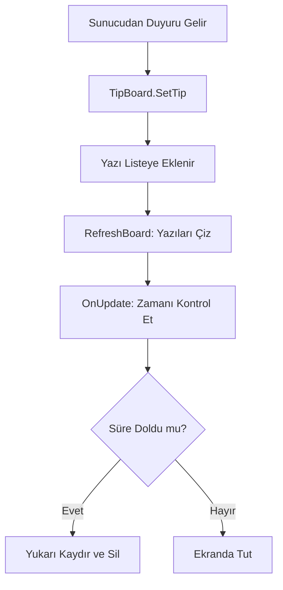

# 🎓 Metin2 Skills: `uiTip.py` (Duyuru ve İpucu Panosu)

`uiTip.py`, ekranın üst kısmında (genellikle mini haritanın solunda) beliren ve yukarıya doğru kayan sunucu duyurularını, etkinlik mesajlarını ve oyun ipuçlarını yöneten dosyadır.

---

## 🔍 Neleri Yönetir?

### 1. Kayan Yazı Sistemi (`TipBoard`)
Mesajların alt alta birikmesini ve belirli bir süre sonra yukarıya doğru kayarak (`Scroll`) kaybolmasını sağlar.
- **Zamanlama:** `SCROLL_WAIT_TIME` (bekleme süresi) ve `TIP_DURATION` (mesajın ömrü) değişkenleri ile yazıların ne kadar süre ekranda kalacağını belirler.

### 2. Metin Çubuğu (`TextBar`)
Metinlerin belirli bir kutu (`ClipRect`) dışına taşmamasını ve pürüzsüz görünmesini sağlamak için `grp` (Grafik) modülünü kullanır.

### 3. Çoklu Mesaj Yönetimi
Aynı anda birden fazla duyuru gelirse, bunları bir sıraya koyar ve sırayla yukarı kaydırarak hepsinin okunmasını sağlar.

---

## 🛠️ Modifikasyon ve Kritik Uyarılar

### ✅ Renkli Duyurular:
Duyuruların önemine göre (örn: Etkinlikler sarı, GM duyuruları kırmızı) farklı renklerde görünmesi için `SetTip` fonksiyonuna renk parametresi eklenebilir.

### ✅ Genişlik ve Konum Ayarı:
Ekran çözünürlüğü yüksek olan modern monitörler için `self.width = 370` değerini artırarak daha uzun cümlelerin tek satırda görünmesini sağlayabilirsin.

### ⚠️ Metin Kayması:
Eğer `STEP_HEIGHT` (satır yüksekliği) değeri yanlış ayarlanırsa, yazılar birbirinin üzerine binebilir veya aralarında çok fazla boşluk kalabilir.

---

## 🚨 Hata Ayıklama (Debug)

**"Duyuru geliyor ama yarısı kesik görünüyor" sorunu:**
1.  `SetClipRect` fonksiyonunun koordinatlarını kontrol et. Yazıların göründüğü "pencere" çok dar ayarlanmış olabilir.
2.  `SetSize` içindeki yükseklik değerinin `STEP_HEIGHT` ile uyumlu olduğundan emin ol.

---

## 📉 uiTip.py İşleyiş Şeması

---

**Sonuç:** `uiTip.py`, oyunun "Haber Bültenidir". Oyuncuların sunucudaki önemli gelişmelerden anlık olarak haberdar olmasını sağlar.
