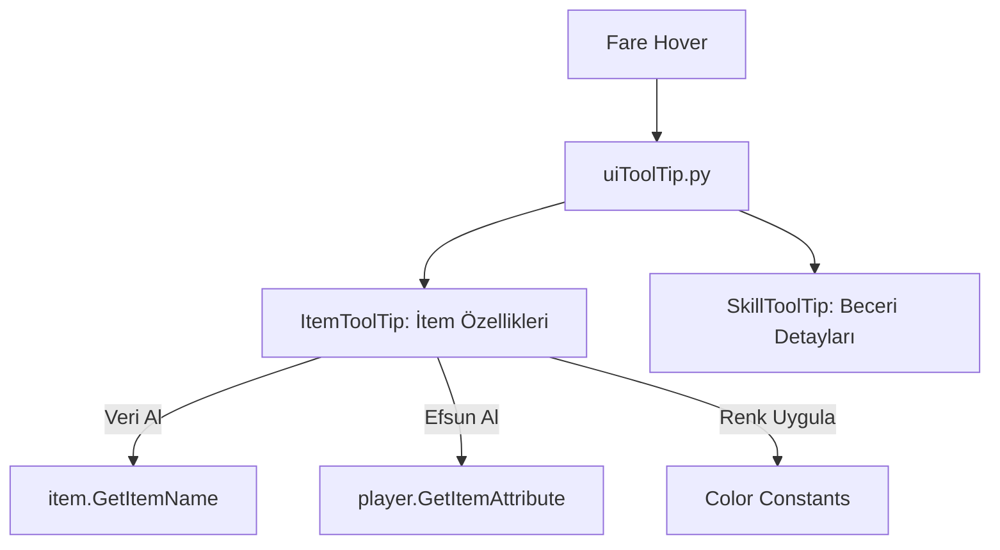

# 🎓 Metin2 Skills: `uiToolTip.py` (Bilgi Penceresi / Hover)

`uiToolTip.py`, fareyi bir itemin, becerinin veya statünün üzerine getirdiğinde açılan o detaylı bilgi penceresinin mimarıdır. "Kılıç +9"un özelliklerini, saldırı değerini ve efsunlarını burada görürüz.

---

## 🔍 Neleri Yönetir?

### 1. İtem Bilgileri (`ItemToolTip`)
Bir itemin adını, seviye sınırını, saldırı/savunma değerlerini ve üzerindeki efsunları (Bonusları) tek tek işler.
- **Renk Mantığı:** Pozitif bonuslar (`POSITIVE_COLOR`) yeşil, negatifler veya yetersiz gereksinimler (`DISABLE_COLOR`) kırmızı görünür.

### 2. Beceri Detayları (`SkillToolTip`)
Becerinin mevcut seviyesindeki hasarını, bir sonraki seviyede ne kadar artacağını ve ne kadar SP harcayacağını hesaplayıp gösterir.

### 3. Otomatik Metin Kaydırma (`SplitDescription`)
Uzun açıklamaların pencerenin dışına taşmaması için metni uygun yerlerden böler ve alt satıra geçer.

---

## 🛠️ Modifikasyon ve Kritik Uyarılar

### ✅ Efsun Renklerini Özelleştirmek:
Eğer "Ortalama Zarar" gibi önemli efsunların farklı bir renkte (örn: Altın sarısı) görünmesini istiyorsan, `SetItemToolTip` fonksiyonu içinde efsun tipini kontrol edip rengi değiştiren bir kod ekleyebilirsin.

### ✅ İtem Karşılaştırma Sistemi:
Envanterdeki bir iteme bakarken, mevcut giydiğin itemle arasındaki farkı (örn: +50 Saldırı Değeri) göstermek için buradaki `AppendTextLine` yapısını kullanabilirsin.

### ⚠️ Performans ve Donma:
Bu dosya binlerce satırdır ve her fare hareketinde tekrar çalışır. İçine ağır döngüler eklemek, oyunun envanterde gezerken anlık olarak takılmasına (Spike) neden olur.

---

## 🚨 Hata Ayıklama (Debug)

**"İtemin üzerinde hiçbir yazı yazmıyor" veya "Oyun kapanıyor" sorunu:**
1.  `item_proto` (Client tarafı) ile bu dosya arasındaki uyumu kontrol et. Eğer protoda olmayan bir değer okunmaya çalışılırsa kod çöker.
2.  `syserr.txt` dosyasında `AppendTextLine` veya `SetItemToolTip` hatası varsa, metin formatlama (`%d`, `%s`) sırasında bir tip uyuşmazlığı olmuş demektir.

---

## 📉 uiToolTip.py Katman Şeması

---

**Sonuç:** `uiToolTip.py`, oyunun "Kütüphanecisidir". Oyuncuya elindeki eşyanın veya becerinin ne kadar değerli olduğunu anlatan ana dildir.
