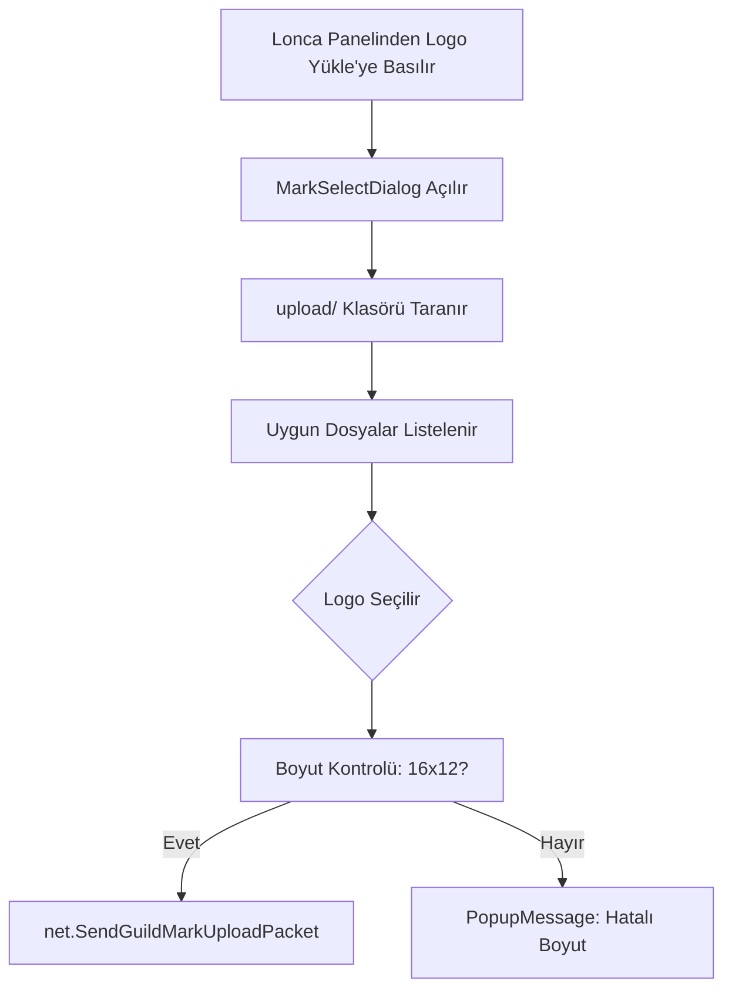

# 🎓 Metin2 Skills: `uiUploadMark.py` (Lonca Logosu Yükleme)

`uiUploadMark.py`, lonca liderlerinin loncalarına özel bir simge (Logo) veya büyük bir bayrak (Symbol) yüklemek için kullandıkları arayüzü yönetir. `upload/` klasöründeki dosyaları tarar ve uygun olanları listeler.

---

## 🔍 Neleri Yönetir?

### 1. Logo Listeleme (`MarkSelectDialog`)
Oyunun kurulu olduğu dizindeki `upload/` klasörünü tarar. İçindeki `.bmp`, `.tga` ve `.jpg` dosyalarını bulup oyuncuya seçmesi için bir liste sunar.

### 2. Görsel Doğrulama (Validation)
Metin2'nin lonca logoları için çok katı kuralları vardır.
- **Logo Boyutu:** Tam olarak **16x12** piksel olmalıdır.
- **Sembol Boyutu:** Büyük bayraklar için **64x128** piksel olmalıdır.
- **Kontrol:** Eğer seçilen resim bu boyutlarda değilse, oyuncuya "Hatalı boyut" uyarısı verir.

### 3. Önizleme (`MarkItem`)
Listelenen dosyaların yanına küçük bir kutucuk içinde logonun nasıl görüneceğine dair bir önizleme koyar.

---

## 🛠️ Modifikasyon ve Kritik Uyarılar

### ✅ Şeffaf Logo Desteği:
Şeffaf (arkası görünmeyen) logolar için `.tga` formatının kullanımı teşvik edilebilir veya bu dosyadaki yükleme mantığı geliştirilerek daha kaliteli önizlemeler sunulabilir.

### ✅ Hazır Logo Paketi:
Sunucuyla birlikte gelen "Standart Logolar" klasörü oluşturup, oyuncunun kendi resmini bulmasıyla uğraşmadan listeden seçebileceği bir kütüphane eklenebilir.

### ⚠️ Hatalı Formatlar:
`app.GetImageInfo` fonksiyonu bazı bozuk veya uyumsuz `.jpg` dosyalarında clientin donmasına neden olabilir. Bu yüzden dosya okuma işlemi sırasında hata yakalama (try-except) çok önemlidir.

---

## 🚨 Hata Ayıklama (Debug)

**"Logoyu seçiyorum ama 'Hatalı Boyut' diyor" sorunu:**
1.  Resmin tam olarak **16x12** olduğundan emin ol (1 piksel bile fark etse sistem reddeder).
2.  Windows'un bazı resim düzenleyicileri kaydederken boyutu otomatik değiştirebilir, bu yüzden dosya özelliklerini kontrol et.

---

## 📉 uiUploadMark.py İşlem Akışı

---

**Sonuç:** `uiUploadMark.py`, bir loncanın "Kimliğini" belirlediği yerdir. Teknik sınırları zorlamadan en estetik logoyu seçmeyi sağlar.
