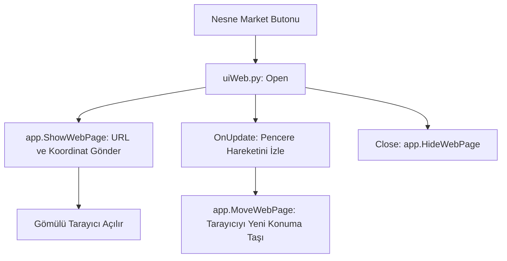

# 🎓 Metin2 Skills: `uiWeb.py` (Oyun İçi Tarayıcı)

`uiWeb.py`, oyunun içindeyken "Nesne Market", "Sıralama" veya "Destek" sayfalarını açmanı sağlayan, oyun motoruna gömülü internet tarayıcısı penceresini yönetir.

---

## 🔍 Neleri Yönetir?

### 1. Web Sayfası Gösterimi (`app.ShowWebPage`)
Belirli bir URL'yi (internet adresini) alır ve oyunun içinde belirlenen koordinatlarda (pencerenin içi) gösterir.
- **Dinamik Takip:** Pencereyi fareyle sürüklediğinde, içindeki web sayfası da pencereyle birlikte hareket eder (`app.MoveWebPage`).

### 2. Nesne Market Entegrasyonu
Çoğu sunucuda Nesne Market, bir web sayfası olarak buraya bağlıdır. Oyuncu oyundan çıkmadan marketten alışveriş yapabilir.

### 3. Kapatma ve Temizleme
Pencere kapandığında veya `Esc` tuşuna basıldığında tarayıcıyı tamamen gizler ve arka planda çalışmasını durdurur (`app.HideWebPage`).

---

## 🛠️ Modifikasyon ve Kritik Uyarılar

### ✅ Güvenli Giriş (Session Key):
Oyuncunun markete girerken tekrar şifre yazmaması için URL'nin sonuna otomatik olarak bir "Giriş Anahtarı" (Session ID) ekleyecek bir mantık buraya eklenebilir.

### ✅ Navigasyon Butonları:
Standart pencerede sadece "Kapat" butonu vardır. Buraya "Geri", "İleri" ve "Anasayfa" butonları ekleyerek tarayıcıyı daha kullanışlı hale getirebilirsin.

### ⚠️ Tarayıcı Motoru Uyumluluğu:
Metin2'nin gömülü tarayıcı motoru genellikle çok eskidir (Internet Explorer tabanlıdır). Bu yüzden buraya bağlanan web sayfalarının modern CSS ve JavaScript özelliklerini desteklemeyebileceğini unutmamalısın.

---

## 🚨 Hata Ayıklama (Debug)

**"Pencere açılıyor ama içi boş/beyaz görünüyor" sorunu:**
1.  İnternet bağlantını ve URL'nin doğruluğunu kontrol et.
2.  Windows'un internet ayarlarının (Proxy vb.) oyunun web sayfasına erişmesini engelleyip engellemediğine bak.

---

## 📉 uiWeb.py Senkronizasyon Şeması

---

**Sonuç:** `uiWeb.py`, oyun dünyası ile gerçek internet dünyası arasındaki "Penceredir". Oyuncuların harici bir tarayıcıya ihtiyaç duymadan web işlemlerini yapmasını sağlar.
