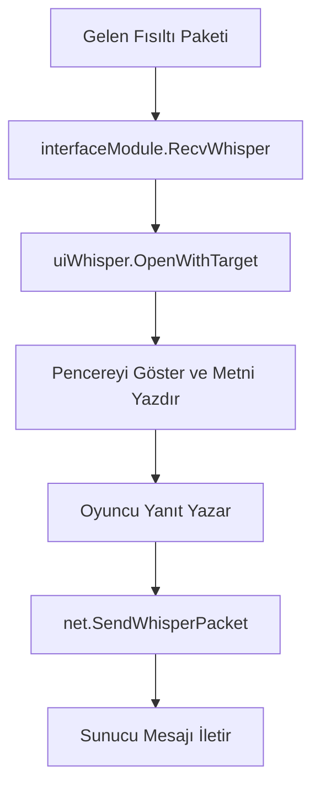

# 🎓 Metin2 Skills: `uiWhisper.py` (Fısıltı / Özel Mesaj)

`uiWhisper.py`, oyuncuların birbirlerine attığı özel mesajların (PM) pencerelerini yönetir. Her bir kişiyle olan konuşman için ayrı bir pencere açılmasını ve mesajların iletilmesini sağlar.

---

## 🔍 Neleri Yönetir?

### 1. Mesaj Gönderimi (`SendWhisper`)
Yazılan metni alır, küfür filtresinden geçirir ve `net.SendWhisperPacket` ile sunucuya iletir.

### 2. Pencere Boyutlandırma (`ResizeWhisperDialog`)
Fısıltı pencerelerinin sağ alt köşesinden tutularak büyütülüp küçültülmesini sağlar. Metin2'nin nadir "yeniden boyutlandırılabilir" pencerelerinden biridir.

### 3. GM (Game Master) Tanıma
Eğer mesaj bir yöneticiden geliyorsa, pencerede özel bir "GM" ikonu (`gamemastermark`) göstererek oyuncunun güvenliğini sağlar.

### 4. Engelleme (Ignore)
İstenmeyen oyuncuları doğrudan fısıltı penceresi üzerinden engellemene olanak tanır.

---

## 🛠️ Modifikasyon ve Kritik Uyarılar

### ✅ Fısıltıya Yeni Butonlar Eklemek:
Mesajlaştığın kişiyi doğrudan arkadaş eklemek veya gruba davet etmek için fısıltı penceresine yeni butonlar ekleyebilirsin. `uiTarget.py`'deki mantığı buraya entegre etmek popüler bir modifikasyondur.

### ✅ Emoji ve İtem Linkleme:
Sohbet satırında (`chatLine`) item linklerinin (Hyperlink) tıklanabilir olmasını sağlayan kontrol buradadır.

### ⚠️ Pencere Kalabalığı:
Her yeni fısıltıda yeni bir pencere objesi oluşturulur. Eğer çok fazla pencereyi kapatmadan açık bırakırsan, oyunun bellek (RAM) kullanımı artabilir.

---

## 🚨 Hata Ayıklama (Debug)

**"Fısıltı geliyor ama pencere açılmıyor" sorunu:**
1.  `interfaceModule.py` içindeki fısıltı yakalayıcıyı kontrol et.
2.  Eğer `WhisperDialog.py` (UIScript) dosyasında bir nesne ismi yanlışsa pencere yüklenemez ve hata verir.

---

## 📉 uiWhisper.py İletişim Akışı

---

**Sonuç:** `uiWhisper.py`, oyunun "Hızlı Mesajlaşma" uygulamasıdır. Buradaki güvenlik ve kullanım kolaylığı (UX) oyuncu deneyimi için hayati önem taşır.
