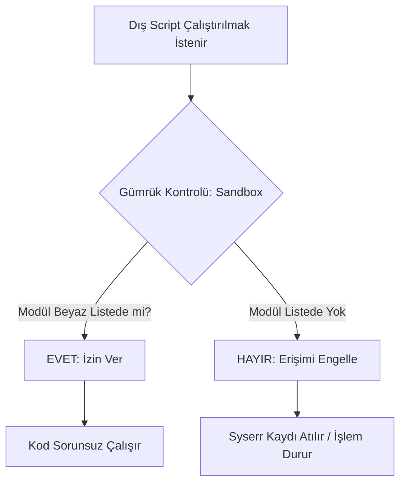

# 🎓 Metin2 Skills: `utils.py` (Sistem Güvenliği)

Bu dosya oyunun "Gümrük Memuru"dur. Dışarıdan gelen kodların (Questler, Etkinlikler) ana sisteme sızmasını engeller.

---

## 🔍 Neyi Değiştirebilirsin?

Burada en çok kurcalanan yer `WHITE_LIST` (Beyaz Liste) kısmıdır.

| Değişken | İşlevi | Değiştirirsen Ne Olur? |
| :--- | :--- | :--- |
| `WHITE_LIST` | İzin verilen ana modüller. | Buraya yeni bir modül eklersen, Sandbox içindeki scriptler o modüle erişebilir. |

---

## 🛠️ Tehlikeli Bölge: Dikkatli Ol!

### ⚠️ Beyaz Listeden Eleman Silmek:
Eğer `__builtin__` veya `sys` modülünü listeden silersen, oyun içindeki birçok pencere (özellikle Quest pencereleri) çalışmayı durdurur. Oyuncu butona tıklar ama hiçbir şey açılmaz. `syserr.txt` dosyası "ImportError" hatalarıyla dolar.

### ✅ Yeni Modül İzni Vermek:
Diyelim ki bir Quest yazdın ve bu questin dosya sistemine erişmesini istiyorsun (normalde yasaktır).
1.  `utils.py` içindeki `WHITE_LIST`'e `'os'` ekle.
2.  Artık Sandbox içinde çalışan scriptler `import os` diyebilir.
3.  **Risk:** Bunu yapmak oyununu dışarıdan gelen saldırılara veya hatalı kodlara karşı savunmasız bırakır.

---

## 🚨 Hata Ayıklama (Debug) Nasıl Yapılır?

Eğer bir pencere açılmıyorsa ve `utils.py`'den şüpheleniyorsan:
1.  `syserr.txt` dosyasını aç.
2.  `"Could not import ..."` hatası görüyor musun bak.
3.  Eğer görüyorsan, o modül Sandbox tarafından engellenmiş demektir. Ya `WHITE_LIST`'e eklemelisin ya da script içinden o importu kaldırmalısın.

---

## 📈 Güvenlik Akış Şeması

