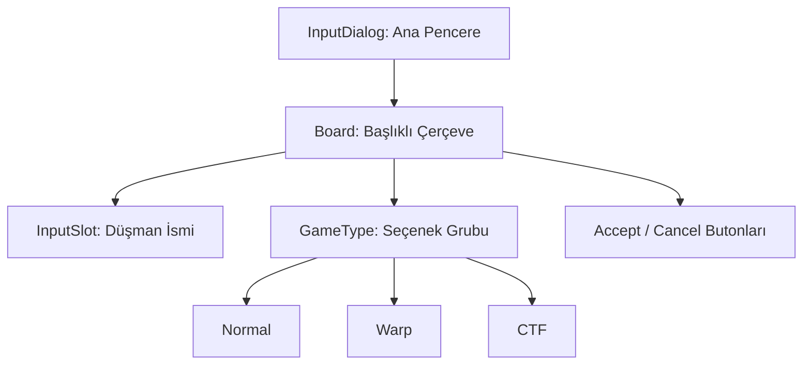

# 🎓 Metin2 Skills: `acceptguildwardialog.py` (Lonca Savaşı Kabul)

`acceptguildwardialog.py`, bir lonca başka bir loncaya savaş ilan ettiğinde, rakip lonca liderinin karşısına çıkan ve savaşın türünü seçmesine/onaylamasına olanak tanıyan penceredir.

---

## 🔍 Neleri Yönetir?

### 1. Savaş Türü Seçimi (`radio_button`)
Lonca savaşının hangi modda yapılacağını belirleyen üç ana seçenek sunar:
- **Normal**: Standart lonca savaşı.
- **Warp**: Işınlanmalı/Alan savaşı.
- **CTF**: Bayrağı kapma modu.

### 2. Düşman İsmi Görüntüleme (`InputSlot`)
Savaşı ilan eden loncanın ismini veya detaylarını gösteren metin alanını barındırır.

### 3. Onay Butonları (`AcceptButton`, `CancelButton`)
Savaş teklifini kabul etmek (`OK`) veya reddetmek (`CANCEL`) için kullanılan butonlardır.

---

## 🛠️ Modifikasyon ve Kritik Uyarılar

### ✅ Yeni Savaş Modu Ekleme:
Eğer sunucuna özel yeni bir lonca savaşı modu (Örn: "Survival") eklersen, buraya yeni bir `radio_button` ekleyerek görsel seçim alanını genişletebilirsin.

### ⚠️ Radio Button Mantığı:
`radio_button` kullanıldığı için oyuncu aynı anda sadece bir savaş modunu seçebilir. Kod tarafında (`root`), seçilen butonun ID'si paket olarak sunucuya gönderilir.

---

## 📉 acceptguildwardialog.py Tasarım Hiyerarşisi

---

**Veri Akışı:** `Server (War Request)` -> `root/uiguild.py` -> `acceptguildwardialog.py` -> Ekran.
