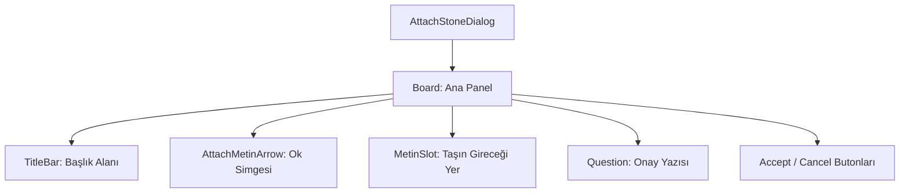

# 🎓 Metin2 Skills: `attachstonedialog.py` (Taş Ekleme Onayı)

`attachstonedialog.py`, envanterdeki bir ruh taşını (Metin Taşı) bir silaha veya zırha sürükleyip bıraktığınızda açılan onay penceresidir.

---

## 🔍 Neleri Yönetir?

### 1. Görsel Slot (`MetinSlot`)
Eklenmek istenen taşın simgesinin göründüğü özel slottur. Genellikle gümüş renkli bir çerçeve (`metin_slot_silver.sub`) ile çevrelenmiştir.

### 2. Yönlendirici Ok (`AttachMetinArrow`)
İşlemin bir "ekleme" olduğunu simgeleyen aşağı yönlü ok görselini yönetir.

### 3. Bilgi Metni (`Question`)
"Bu taşı eklemek istiyor musunuz?" gibi onay sorusunu `uiScriptLocale` üzerinden çeker.

### 4. Onay Butonları (`AcceptButton`, `CancelButton`)
İşlemi onaylar (`YES`) veya iptal eder (`NO`).

---

## 🛠️ Modifikasyon ve Kritik Uyarılar

### ✅ Görsel Özelleştirme:
Pencere boyutları `0` olarak ayarlanmış olabilir, bu durumda boyutlar `root` tarafındaki `uiattachmetin.py` içinden dinamik olarak hesaplanır. Eğer pencereyi sabit bir boyuta getirmek istersen hem `.py` hem de `uiscript` değerlerini eşitlemelisin.

### ⚠️ Slot Resimleri:
`MetinImage` içindeki resim yolu genellikle bir yer tutucudur. Gerçek taş simgesi, sürüklenen eşyanın ikonuna göre kod tarafında anlık olarak atanır.

---

## 📉 attachstonedialog.py Tasarım Hiyerarşisi

---

**Veri Akışı:** `Envanter (Drag & Drop)` -> `root/uiattachmetin.py` -> `attachstonedialog.py` -> Ekran.
