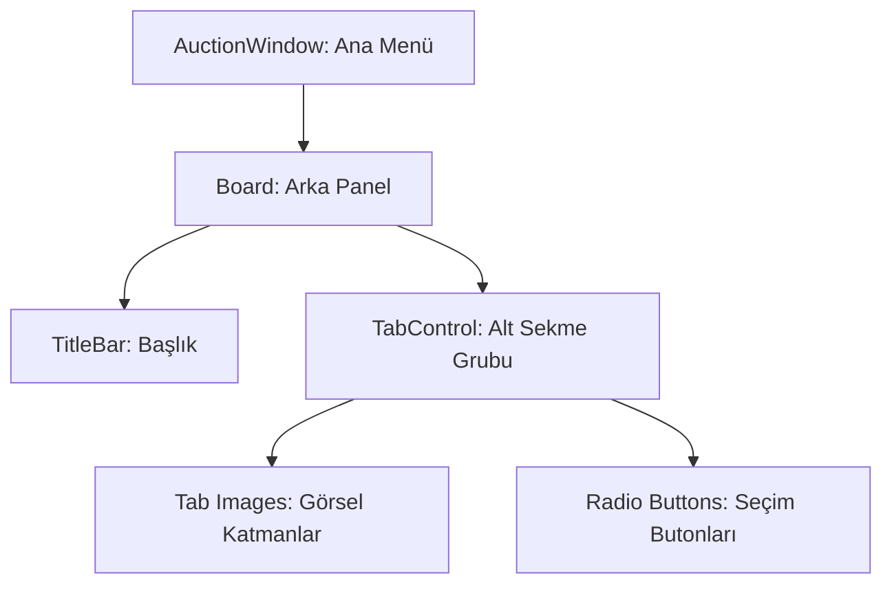

# 🎓 Metin2 Skills: `auctionwindow.py` (Açık Artırma Sistemi)

`auctionwindow.py`, oyuncuların eşyalarını ihaleye çıkarabildiği veya başkalarının tekliflerini görebildiği "Açık Artırma" sisteminin ana menü tasarımıdır.

---

## 🔍 Neleri Yönetir?

### 1. Sekme Sistemi (`TabControl`)
Pencerenin alt kısmında bulunan ve farklı sayfalar (İhaleler, Tekliflerim, Eşya Kaydet vb.) arasında geçiş yapmayı sağlayan butonları yönetir.
- **`Tab_01`, `Tab_02`, `Tab_03`**: Sekmelerin görsel hallerini (`tab_1.sub`, `tab_2.sub`, `tab_3.sub`) tanımlar.
- **`radio_button`**: Hangi sekmenin seçili olduğunu belirleyen tıklanabilir alanlardır.

### 2. Panel Yapısı (`Board`)
Pencerenin genel boyutlarını (376x370) ve "Açık Artırma" başlığını belirler.

---

## 🛠️ Modifikasyon ve Kritik Uyarılar

### ✅ Yeni Sekme Ekleme:
Eğer sisteme 4. bir kategori (Örneğin: "Geçmiş İhaleler") eklemek istersen, hem `image` (Tab_04) hem de `radio_button` (Tab_Button_04) eklemen gerekir.

### ⚠️ Görsel Yolları:
`ROOT_PATH` değişkeni `d:/ymir work/ui/game/guild/` yoluna bakar. Eğer görselleri göremiyorsan bu yolu veya `ETC` içindeki dosyaları kontrol etmelisin.

---

## 📈 auctionwindow.py Tasarım Hiyerarşisi

---

**Veri Akışı:** `Server (İhale Verisi)` -> `uiauction.py` (Logic) -> `auctionwindow.py` (Tasarım) -> Ekran.
