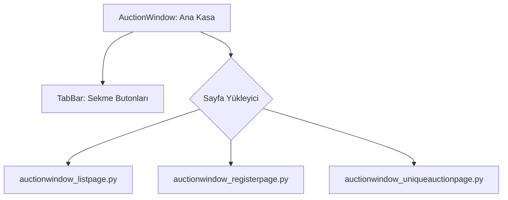

# 🎓 Metin2 Skills: `auctionwindow.py` (Müzayede Sistemi)

`auctionwindow.py`, oyuncuların eşya alıp satabildiği açık artırma (Müzayede) sisteminin ana arayüzüdür. Bu sistem genellikle bir ana pencere ve içine yüklenen alt sayfalardan oluşur.

---

## 🔍 Neleri Yönetir?

### 1. Ana Sekme Yapısı
Sistem üç ana bölümden oluşur ve her biri ayrı bir `.py` dosyasıyla tanımlanır:
- **`auctionwindow_listpage.py`**: Mevcut müzayedelerin listelendiği, eşya arama ve filtreleme yapılan ana liste sayfasıdır.
- **`auctionwindow_registerpage.py`**: Oyuncunun kendi eşyasını müzayedeye koyduğu (kayıt ettiği) sayfadır. Başlangıç fiyatı ve süre ayarları buradadır.
- **`auctionwindow_uniqueauctionpage.py`**: Sınırlı sayıda veya özel (eşsiz) eşyaların satıldığı özel müzayede sekmesidir.

### 2. Tab Kontrolleri
Pencerenin üst kısmında yer alan "Müzayede", "Kayıt", "Özel" gibi sekmeler arası geçişi sağlayan buton grubunu yönetir.

---

## 🛠️ Modifikasyon ve Kritik Uyarılar

### ✅ Sayfa Tasarımı:
Her bir alt sayfa (`listpage`, `registerpage` vb.) kendi içinde bağımsız koordinatlara sahiptir. Eğer listedeki eşya sayısını artırmak istersen `listpage.py` içindeki `ListBox` boyutlarını güncellemelisin.

### ⚠️ Senkronizasyon:
Sekme butonlarına tıklandığında hangi dosyanın yükleneceği `root/uiauction.py` içindeki `SetState` fonksiyonu ile kontrol edilir. Dosya isimlerini değiştirirsen kod tarafını da güncellemelisin.

---

## 📉 auctionwindow.py Tasarım Hiyerarşisi

---

**Veri Akışı:** `Server (Auction Data)` -> `root/uiauction.py` -> `auctionwindow.py` -> Ekran.
