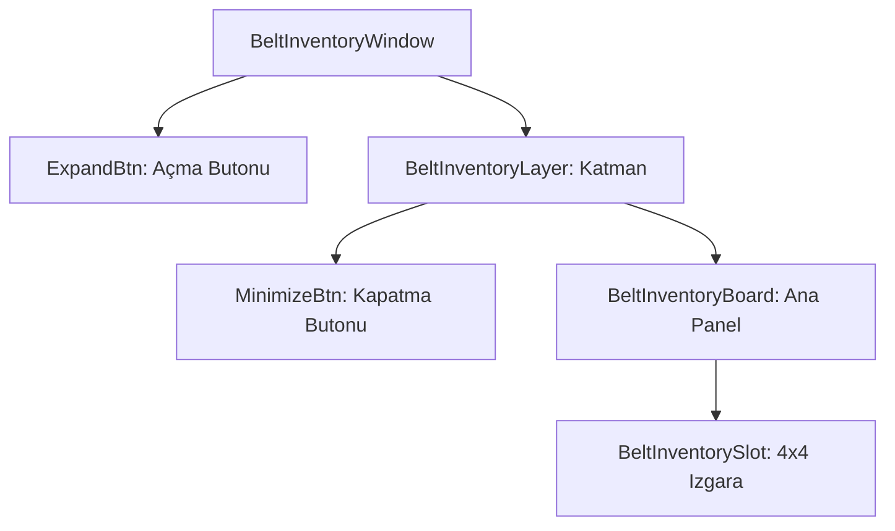

# 🎓 Metin2 Skills: `beltinventorywindow.py` (Kemer Envanteri)

`beltinventorywindow.py`, oyuncu bir kemer taktığında aktifleşen ve sadece belirli eşyaların (İksirler vb.) konulabildiği ek envanter alanıdır.

---

## 🔍 Neleri Yönetir?

### 1. Genişleme ve Küçültme (`Expand / Minimize`)
Kemer envanteri genellikle kapalı durur. Oyuncu yandaki ok butonuna (`ExpandBtn`) bastığında pencere açılır; `MinimizeBtn` ile tekrar gizlenir.

### 2. Kemer Slotları (`BeltInventorySlot`)
- **`4x4 Grid`**: Toplam 16 adet ek slot barındırır.
- **`item.BELT_INVENTORY_SLOT_START`**: Bu slotların index numaraları kemer sistemine özeldir ve genellikle 180'den başlar.

### 3. Arka Plan Görseli (`bg.tga`)
Pencerenin temasını belirleyen ve `belt_inventory` klasöründen çekilen özel bir arka plan resmidir.

---

## 🛠️ Modifikasyon ve Kritik Uyarılar

### ✅ Slot Kısıtlaması:
Kemer envanterine her eşya konulamaz. Hangi eşyaların buraya girebileceği `root/uiinventory.py` içindeki `CanInBelt` veya benzeri fonksiyonlarla kod tarafında kısıtlanır.

### ⚠️ Görsel Yollar:
Kullanılan `.tga` resimleri `pack/ETC` içindeki `ymir work/ui/game/belt_inventory/` klasöründe bulunmalıdır.

---

## 📉 beltinventorywindow.py Tasarım Hiyerarşisi

---

**Veri Akışı:** `Server (Belt Data)` -> `root/uiinventory.py` -> `beltinventorywindow.py`.
