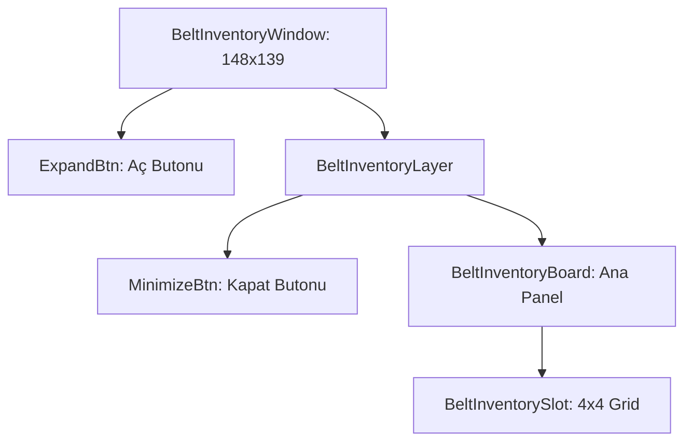

# 🎓 Metin2 Skills: `beltinventorywindow.py` (Kemer Envanteri Tasarımı)

`beltinventorywindow.py`, belirli kemerler takıldığında envanterin yanında açılan ekstra 4x4 (16 slot) iksir/sarf malzeme alanının tasarım dosyasıdır.

---

## 🔍 Neleri Yönetir?

### 1. Kemer Slotları (`BeltInventorySlot`)
4x4 boyutunda bir `grid_table` ile toplam 16 adet iksir veya sarf malzeme slotu sunar. Başlangıç indeksi `item.BELT_INVENTORY_SLOT_START` sabitinden otomatik çekilir.

### 2. Genişlet / Küçült Butonları (`ExpandBtn` / `MinimizeBtn`)
Panel iki durumda çalışır:
- **Kapalı (Minimized):** Sadece küçük bir ok butonu görünür.
- **Açık (Expanded):** Tam slot ızgarası görünür hale gelir.

### 3. Katmanlı Yapı (`BeltInventoryLayer`)
Panel, genişletme/küçültme animasyonunu desteklemek için iç içe geçmiş pencere katmanları kullanır.

### 4. Özel Arka Plan (`bg.tga`)
Standart envanter çerçevesi yerine kemer temalı özel bir arka plan görseli kullanır.

---

## 🛠️ Modifikasyon ve Kritik Uyarılar

### ✅ Slot Kapasitesini Artırma:
`x_count` veya `y_count` değerlerini artırarak daha fazla slot ekleyebilirsin. Ancak sunucu tarafındaki `BELT_INVENTORY_SLOT_COUNT` değerini de buna göre güncellemelisin.

### ✅ Konum Senkronizasyonu:
Bu pencere envanterin soluna yapışacak şekilde konumlanmıştır (`SCREEN_WIDTH - 176 - 148`). Envanter boyutunu değiştirirsen buradaki ofseti de güncellemelisin.

### ⚠️ Kemer Bağımlılığı:
Bu pencere sadece uygun bir kemer eşyası takıldığında gösterilir. Kemer takılı değilse bu pencere hiç oluşturulmaz.

---

## 📉 beltinventorywindow.py Katman Şeması

---

**Sonuç:** `beltinventorywindow.py`, savaşçıların "Taktik Çantası"dır. İksirlere anında erişimi sağlayarak savaş sırasındaki tepki süresini kısaltır.
