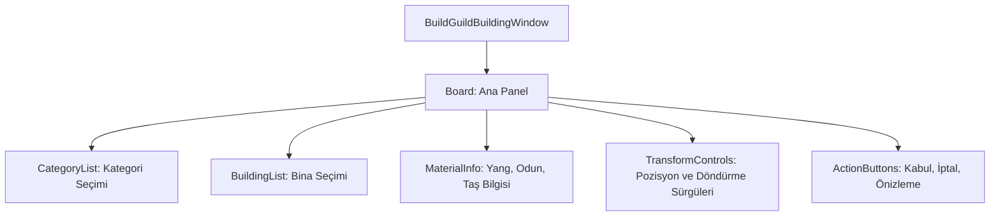

# 🎓 Metin2 Skills: `buildguildbuildingwindow.py` (Lonca Binası İnşaatı)

`buildguildbuildingwindow.py`, lonca arazisine bina (saray, fırın, maden ocağı vb.) eklemek için kullanılan, gelişmiş bir yerleşim ve koordinat kontrol penceresidir.

---

## 🔍 Neleri Yönetir?

### 1. Kategori ve Bina Listesi (`ListBox`)
İnşa edilebilecek binaları kategorilere ayırır ve seçilen kategorideki binaları listeler. Oyuncu bu listeden istediği yapıyı seçer.

### 2. Malzeme ve Ücret Göstergesi
Binanın inşa edilmesi için gereken;
- **Yang**: Para miktarı.
- **Odun / Taş / Kontrplak**: İnşaat malzemelerinin miktarlarını gösteren slotları barındırır.

### 3. Konum ve Döndürme Kontrolleri (`SliderBar`)
Binanın dünya üzerindeki X ve Y koordinatlarını belirlemeyi, ayrıca X, Y, Z eksenlerinde döndürülmesini (`Rotation`) sağlayan sürgülü çubukları (Slider) yönetir.

### 4. Önizleme (`PreviewButton`)
Binayı kalıcı olarak inşa etmeden önce harita üzerinde nasıl görüneceğini görmeyi sağlayan butondur.

---

## 🛠️ Modifikasyon ve Kritik Uyarılar

### ✅ Yeni Malzeme Ekleme:
Eğer inşaat için yeni bir malzeme (Örn: Demir) eklemek istersen, buraya yeni bir `text` ve `slotbar` bloğu ekleyerek görselini tanımlamalısın.

### ⚠️ Koordinat Hassasiyeti:
`BuildingPositionXValue` gibi alanlar, `root` tarafındaki `uibuildguildbuilding.py` ile sürekli güncellenir. Bu pencere, oyuncunun fare ile bina taşımasına olanak tanıyan görsel bir arayüzdür.

---

## 📉 buildguildbuildingwindow.py Tasarım Hiyerarşisi

---

**Veri Akışı:** `pack/guild` (Model) -> `root/uibuildguildbuilding.py` -> `buildguildbuildingwindow.py` -> Ekran.
