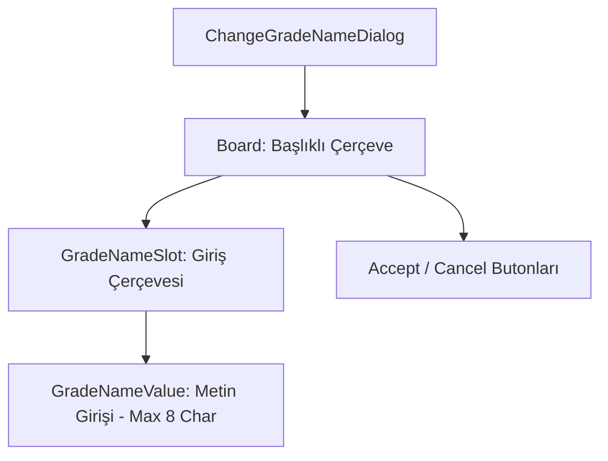

# 🎓 Metin2 Skills: `changegradenamedialog.py` (Lonca Rütbe İsmi Değiştirme)

`changegradenamedialog.py`, lonca liderinin rütbe isimlerini (Örn: Lider, Üye, Acemi) yeniden adlandırmasını sağlayan küçük bir giriş penceresidir.

---

## 🔍 Neleri Yönetir?

### 1. Metin Giriş Alanı (`GradeNameValue`)
Kullanıcının yeni rütbe ismini yazabileceği bir `editline` barındırır.
- **`input_limit: 8`**: Rütbe isimlerinin en fazla 8 karakter olabileceğini belirler. Bu sınır, veritabanı ve UI uyumluluğu için kritiktir.

### 2. Görsel Slot (`GradeNameSlot`)
Yazı yazılan alanın etrafındaki çerçeveyi (`Parameter_Slot_02.sub`) yönetir.

### 3. Onay ve İptal Butonları
Girilen ismin kaydedilmesi veya işlemin iptal edilmesi için kullanılır.

---

## 🛠️ Modifikasyon ve Kritik Uyarılar

### ✅ Karakter Sınırını Artırma:
Eğer daha uzun rütbe isimleri istiyorsan `input_limit` değerini artırabilirsin. Ancak bu durumun hem server tarafındaki SQL tablolarında hem de `guildwindow` (Lonca Penceresi) üzerindeki sütun genişliklerinde desteklenmesi gerekir.

### ⚠️ Başlık Dinamiği:
Pencere başlığı `uiScriptLocale.GUILD_GRADE_CHANGE_GRADE_NAME` üzerinden çekilir, böylece farklı dillerde (TR, EN, DE) otomatik olarak güncellenir.

---

## 📉 changegradenamedialog.py Tasarım Hiyerarşisi

---

**Veri Akışı:** `root/uiguild.py` -> `changegradenamedialog.py` -> Ekran.
