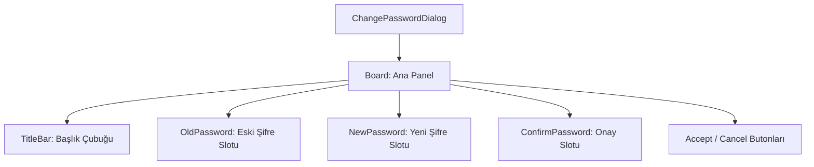

# 🎓 Metin2 Skills: `changepassworddialog.py` (Şifre Değiştirme - Depo)

`changepassworddialog.py`, oyuncunun depo (Safebox) şifresini değiştirmek istediğinde açılan, eski ve yeni şifre girişlerini içeren güvenlik penceresidir.

---

## 🔍 Neleri Yönetir?

### 1. Şifre Giriş Alanları (`editline`)
Üç farklı giriş alanı barındırır:
- **Eski Şifre**: Doğrulama için mevcut şifre.
- **Yeni Şifre**: Belirlenmek istenen yeni şifre.
- **Şifre Onayı**: Yeni şifrenin tekrarı.

### 2. Güvenlik Bayrağı (`secret_flag : 1`)
Tüm giriş alanlarında `secret_flag : 1` kullanılmıştır. Bu, yazılan karakterlerin ekranda görünmesini engeller ve yerine yıldız (`*`) veya nokta basarak şifrenin gizli kalmasını sağlar.

### 3. Karakter Sınırı (`input_limit : 6`)
Metin2 depo şifreleri standart olarak 6 karakterdir. Bu sınırlama `input_limit` ile UI seviyesinde kontrol edilir.

---

## 🛠️ Modifikasyon ve Kritik Uyarılar

### ✅ Tasarım İyileştirme:
Eğer şifre alanlarının çok dar olduğunu düşünüyorsan, `width` değerini ve `Parameter_Slot_02.sub` yerine daha geniş bir slot görselini kullanabilirsin.

### ⚠️ Secret Flag Önemli:
Bu pencerede `secret_flag` kapatılırsa, oyuncu şifresini yazarken etrafındakiler şifreyi görebilir. Güvenlik için bu değerin her zaman `1` olması gerekir.

---

## 📉 changepassworddialog.py Tasarım Hiyerarşisi

---

**Veri Akışı:** `root/uisafebox.py` -> `changepassworddialog.py` -> Ekran.
