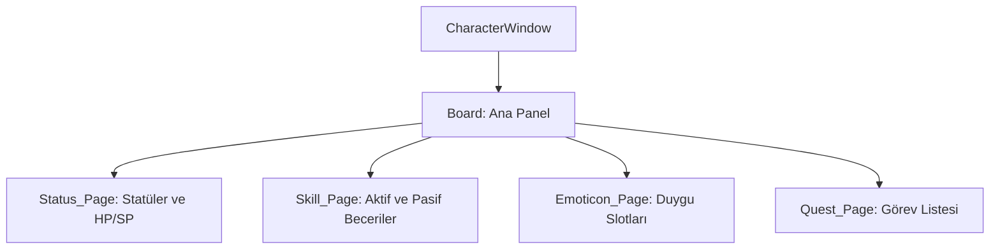

# 🎓 Metin2 Skills: `characterwindow.py` (Karakter Bilgi Paneli)

`characterwindow.py`, oyuncunun seviyesini, statü puanlarını (VIT, INT, STR, DEX), becerilerini (Skill), duygularını (Emoticon) ve görevlerini (Quest) yönettiği en kapsamlı bilgi panelidir.

---

## 🔍 Neleri Yönetir?

### 1. Statü Sayfası (`Status_Page`)
Karakterin temel güç değerlerini ve HP, SP, Atak hızı gibi ikincil istatistiklerini barındırır.
- **`Status_Plus_Button`**: Statü puanı arttığında beliren küçük artı butonlarını yönetir.

### 2. Beceri Sayfası (`Skill_Page`)
Karakterin aktif ve pasif becerilerini yönetir.
- **`Skill_Active_Slot`**: Savaş becerilerinin (Hava Kılıcı, Öfke vb.) yerleştiği slottur.
- **`Skill_ETC_Slot`**: Madencilik, Binicilik, Liderlik gibi yardımcı pasif becerileri barındırır.
- **`Skill_Group_Button`**: Beceri grubu seçimini (Örn: Savaşçıda Bedensel/Zihinsel ayrımı) sağlayan radyo butonlarıdır.

### 3. Duygu ve Görev Sayfaları
- **`Emoticon_Page`**: Solo ve karşılıklı (Dans, Öpücük vb.) duyguların slotlarını barındırır.
- **`Quest_Page`**: Mevcut görevlerin listesini ve detaylarını (`Quest_ScrollBar`) yönetir.

---

## 🛠️ Modifikasyon ve Kritik Uyarılar

### ✅ Yeni Statü Ekleme:
Eğer oyuna yeni bir statü (Örn: "Şans") eklemek istersen, `characterwindow.py` içinde yeni bir `text` ve `button` bloğu tanımlamalı ve koordinatları mevcut listeye göre hizalamalısın.

### ⚠️ Slot Kimlikleri (Index):
`Skill_Active_Slot` içindeki `index` değerleri (1, 21, 41...), beceri gruplarına göre atanmıştır. Bu numaralar `skill_proto` ile doğrudan eşleşir. Yanlış index verilmesi becerilerin görünmemesine neden olur.

---

## 📉 characterwindow.py Tasarım Hiyerarşisi

---

**Veri Akışı:** `Server (Status/Skill Data)` -> `root/uicharacter.py` -> `characterwindow.py` -> Ekran.
