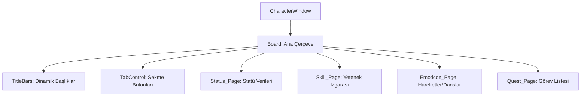

# 🎓 Metin2 Skills: `characterwindow.py` (Karakter Bilgi Ekranı Tasarımı)

`characterwindow.py`, oyuncunun statülerini (HP, SP, STR vb.), becerilerini (Skill), duygularını (Emotion) ve aktif görevlerini gördüğü çok sekmeli ana panelin tasarım dosyasıdır.

---

## 🔍 Neleri Yönetir?

### 1. Sekmeli Yapı (`TabControl`)
Pencerenin alt kısmında bulunan ve Statü, Beceri, Duygular ve Görevler arasında geçiş yapmayı sağlayan buton grubunu yönetir.

### 2. Statü Slotları (`Parameter_Slot`)
VIT, INT, STR, DEX gibi temel değerlerin ve Saldırı Değeri, Savunma gibi detaylı bilgilerin yazılacağı kutucukların yerlerini belirler.

### 3. Beceri Sayfası (`Skill_Page`)
Karakterin yeteneklerinin (Örn: Hava Kılıcı) dizileceği ızgara (Grid) yapısını tanımlar. Her yetenek için belirli bir koordinat atanmıştır.

### 4. Dinamik Başlıklar (`TitleBar`)
Hangi sekme seçiliyse (Örn: Görevler), o sekmenin başlığının (`TitleName`) en üstte görünmesini sağlar.

---

## 🛠️ Modifikasyon ve Kritik Uyarılar

### ✅ Yeni Statü Ekleme:
Eğer oyununa "Kritik Şans" veya "Delici Şans" gibi yeni bir statü satırı eklemek istiyorsan, statü sekmesi (`Status_Page`) içindeki boş alanlara yeni metin ve kutucuk nesneleri eklemelisin.

### ✅ Skill Düzeni:
6. veya 7. yetenekleri eklediğinde, bu yeteneklerin simgelerinin envanterdeki gibi üst üste binmemesi için buradaki koordinatları (`x`, `y`) genişletmelisin.

### ⚠️ Tab Buton Senkronizasyonu:
Buradaki butonların adı (Örn: `Tab_Button_01`), `uiCharacter.py` içindeki kodlarla eşleşmelidir. İsim değişirse butonlar çalışmaz.

---

## 🚨 Hata Ayıklama (Debug)

**"Statü puanım var ama '+' butonuna basamıyorum" sorunu:**
1.  `characterwindow.py` içinde o statünün yanındaki "artı" butonunun (`Status_Plus_Button`) koordinatlarını kontrol et. Bazen bir görsel (Image) butonun üzerine biner ve tıklamayı engeller.
2.  Butonun `name` değerinin doğru olduğundan emin ol.

---

## 📉 characterwindow.py Yapısal Düzeni

---

**Sonuç:** `characterwindow.py`, oyuncunun karakter gelişimini takip ettiği "Kontrol Panelidir". Karakterin tüm teknik verilerinin görsel sunumu buradan yönetilir.
