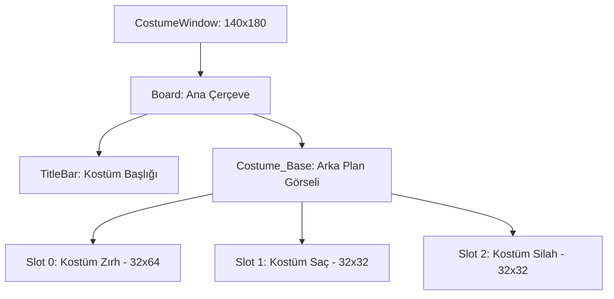

# 🎓 Metin2 Skills: `costumewindow.py` (Kostüm Paneli Tasarımı)

`costumewindow.py`, envanterin yanında açılan ve Kostüm Zırh, Kostüm Saç ve Kostüm Silah slotlarını barındıran küçük ek panelin tasarım dosyasıdır.

---

## 🔍 Neleri Yönetir?

### 1. Kostüm Slotları (`CostumeSlot`)
Üç adet özel slot sunar:
- **`COSTUME_START_INDEX+0`**: Kostüm Zırh (Görsel Zırh). Karakterin dış görünüşünü değiştirir ama gerçek zırhın bonuslarını etkilemez.
- **`COSTUME_START_INDEX+1`**: Kostüm Saç (Peruğ). Saç stilini değiştirir.
- **`COSTUME_START_INDEX+2`**: Kostüm Silah. Silahın görselini değiştirir.

### 2. Arka Plan Görseli (`Costume_Base`)
Kostüm slotlarının arkasındaki tematik resmi (`costume_bg.jpg`) yönetir. Bu, envanter arka planından farklı bir tasarıma sahiptir.

### 3. Dinamik Başlangıç İndeksi (`COSTUME_START_INDEX`)
Slot numaraları `item.COSTUME_SLOT_START` sabitinden otomatik olarak çekilir. Bu sayede sunucu tarafında slot numaraları değişirse, bu dosya da otomatik olarak güncellenir.

---

## 🛠️ Modifikasyon ve Kritik Uyarılar

### ✅ Yeni Kostüm Slotu Ekleme (Örn: Kanat):
Eğer sunucun "Kostüm Kanat" destekliyorsa, `slot` listesine yeni bir `{"index": COSTUME_START_INDEX+3, ...}` satırı ekleyerek görsel alanı oluşturabilirsin. Tabii pencere boyutunu da (`height`) artırman gerekir.

### ✅ Konum Ayarlama:
Pencere varsayılan olarak envanterin soluna (`SCREEN_WIDTH - 175 - 140`) yapışır. Bu sayede oyuncu ikisini birlikte görür.

### ⚠️ item Modülü Bağımlılığı:
Bu dosya `import item` ile doğrudan oyun motoruna bağlıdır. `item.COSTUME_SLOT_START` sabiti motorun binary'sinde tanımlıdır; Python tarafından değiştirilemez.

---

## 🚨 Hata Ayıklama (Debug)

**"Kostüm penceresi açılıyor ama slotlar boş görünüyor" sorunu:**
1.  `costume_bg.jpg` dosyasının belirtilen yolda mevcut olduğunu kontrol et.
2.  Slot koordinatlarının (`x`, `y`) arka plan görselinin boyutlarıyla uyumlu olduğundan emin ol.

---

## 📉 costumewindow.py Slot Düzeni

---

**Sonuç:** `costumewindow.py`, oyuncunun "Giyinme Odası"dır. Gerçek eşyaları etkilemeden karakterin dış görünüşünü değiştirmeyi sağlar.
