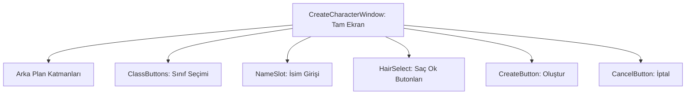

# 🎓 Metin2 Skills: `createcharacterwindow.py` (Karakter Oluşturma Tasarımı)

`createcharacterwindow.py`, yeni bir karakter oluşturulurken görünen tam ekran arayüzün tasarım dosyasıdır. İsim girişi, sınıf ve cinsiyet seçimi, saç stili seçimi gibi bölümleri içerir.

---

## 🔍 Neleri Yönetir?

### 1. Sınıf Seçim Butonları
Savaşçı, Ninja, Sura ve Şaman sınıflarını temsil eden büyük butonların konumlarını ve görsellerini belirler.

### 2. İsim Girişi (`NameSlot`)
Karakter isminin yazılacağı metin kutusunun konumunu ve karakter sınırını yönetir.

### 3. Saç ve Görünüm Seçimi
Saç stilini ileri/geri değiştiren ok butonlarının ve saç önizleme alanının yerleşimini düzenler.

### 4. Tam Ekran Arka Plan
`selectcharacterwindow.py` ile aynı tarzda `expanded_image` ve ölçekleme formülleri kullanarak her çözünürlükte tam ekran kaplar.

---

## 🛠️ Modifikasyon ve Kritik Uyarılar

### ✅ Yeni Sınıf Ekleme:
Eğer sunucun 5. bir sınıf (Örn: Lycan) destekliyorsa, yeni bir sınıf butonu ekleyerek ve mevcut butonların koordinatlarını sıkıştırarak yer açabilirsin.

### ⚠️ Ölçek Formülleri:
Sabit piksel değerleri yerine `SCREEN_WIDTH * X / 800` gibi oransal formüller kullanılır. Sabit değer yazarsan farklı çözünürlüklerde bozulma olur.

---

## 📉 createcharacterwindow.py Yapısı

---

**Sonuç:** `createcharacterwindow.py`, oyuncunun "Doğum Belgesi"dir. Karakterin ilk adımları burada atılır.
