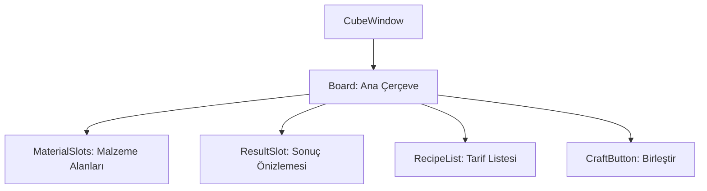

# 🎓 Metin2 Skills: `cubewindow.py` (Simya Penceresi Tasarımı)

`cubewindow.py`, Simyacı NPC'sindeki "Birleştirme" (Cube) sisteminin arayüz tasarımını yöneten dosyadır. Malzemeleri koyarak yeni eşyalar üretmeyi sağlar.

---

## 🔍 Neleri Yönetir?

### 1. Malzeme Slotları
Birleştirme tarifinde gereken ham malzemelerin konulacağı slot alanlarını yönetir.

### 2. Sonuç Önizlemesi
Birleştirme başarılı olursa çıkacak eşyanın gösterildiği önizleme slot'unun konumunu belirler.

### 3. Tarif Listesi ve Kaydırma
Mevcut tariflerin listelenmesi için bir alan ve kaydırma çubuğu sunar. Oyuncu tarifleri tarayarak neyi üretebileceğini görebilir.

### 4. Birleştir Butonu
Malzemeler yerleştirildikten sonra işlemi başlatan butonun konumunu ve görselini yönetir.

---

## 🛠️ Modifikasyon ve Kritik Uyarılar

### ✅ Yeni Tarifler:
Tarif verileri sunucu tarafından gelir. Bu dosyada sadece görsel yerleşim değiştirilir; tariflerin kendisi `cube.txt` veya veritabanından yönetilir.

### ⚠️ Slot Sınırları:
Malzeme slot sayısını artırmak için hem bu dosyayı hem de `uiCube.py` kodunu güncellemen gerekir.

---

## 📉 cubewindow.py Yapısı

---

**Sonuç:** `cubewindow.py`, oyunun "Atölyesi"dir. Gereksiz malzemelerden değerli eşyalar üretmek bu pencereden yönetilir.
