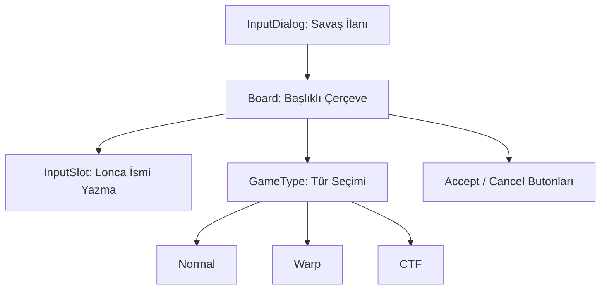

# 🎓 Metin2 Skills: `declareguildwardialog.py` (Lonca Savaşı İlanı)

`declareguildwardialog.py`, bir lonca liderinin rakip bir loncaya savaş açmak istediğinde kullandığı, düşman lonca ismini girdiği ve savaş türünü seçtiği penceredir.

---

## 🔍 Neleri Yönetir?

### 1. Rakip Lonca İsmi Girişi (`InputValue`)
Savaş ilan edilecek loncanın isminin yazıldığı `editline` alanıdır.
- **`input_limit : 12`**: Lonca isimlerinin maksimum karakter sınırını kontrol eder.

### 2. Savaş Modu Seçimi (`radio_button`)
İlan edilecek savaşın türünü belirler:
- **Normal**: Standart meydan savaşı.
- **Warp**: Işınlanmalı alan savaşı.
- **CTF**: Bayrak kapma mücadelesi.

### 3. İlan Butonları (`AcceptButton`, `CancelButton`)
Savaşı başlatır (`OK`) veya iptal eder (`CANCEL`).

---

## 🛠️ Modifikasyon ve Kritik Uyarılar

### ✅ Varsayılan Savaş Modu:
Oyun genellikle "Normal" modu varsayılan olarak seçili getirir. Bunu değiştirmek için `root/uiguild.py` içindeki `Open` fonksiyonunda hangi butonun `Down` durumunda olacağı ayarlanmalıdır.

### ⚠️ İsim Doğruluğu:
Buraya yazılan isim, sunucu tarafında (`game` core) kontrol edilir. Eğer lonca ismi yanlışsa veya lonca savaşa uygun değilse sistem hata mesajı döndürür.

---

## 📉 declareguildwardialog.py Tasarım Hiyerarşisi

---

**Veri Akışı:** `root/uiguild.py` -> `declareguildwardialog.py` -> `Server (War Start Packet)`.
