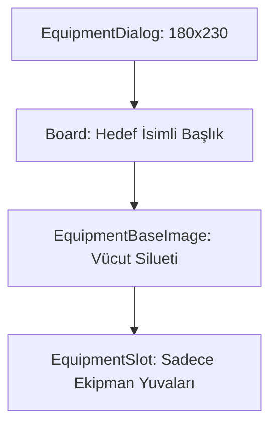

# 🎓 Metin2 Skills: `equipmentdialog.py` (Hedef Ekipman Tasarımı)

`equipmentdialog.py`, oyuncunun başka bir karaktere sağ tıklayarak "Ekipman Görüntüle" dediğinde (veya Casus Camı gibi eşyalarla) açılan, sadece görüntüleme amaçlı ekipman penceresidir.

---

## 🔍 Neleri Yönetir?

### 1. Daraltılmış Ekipman Slotları
Kendi envanterimizdekinden farklı olarak burada envanter kutuları (Çanta) yoktur. Sadece Zırh, Silah, Kask, Kolye, Küpe gibi `EquipmentSlot` alanları bulunur.

### 2. Arka Plan Şablonu
Eşyaların yerleşeceği arkaplan görseli olarak `equipment_bg_without_ring.tga` (Nişan/Yüzük hariç) veya benzeri özel bir şablon kullanır.

### 3. Özel Başlık (`TitleBar`)
Başlık alanında sabit bir "Ekipman" yazısı yerine, ekipmanı görüntülenen hedefin ismi yazar (`title : "Character Name"`). Kod tarafında bu başlık dinamik olarak hedefin ismiyle değiştirilir.

---

## 🛠️ Modifikasyon ve Kritik Uyarılar

### ✅ Nişan / Kemer Eklemek:
Standart Metin2'de diğer oyuncunun kemerini veya yüzüğünü görmek kapalı olabilir. Slot listesine `{"index":21 ...}` gibi yorum satırı (##) yapılmış alanları açarak, karşı tarafın yüzüklerini de gösterebilirsin. (Tabii sunucu tarafının da bu veriyi yollaması gerekir).

### ⚠️ Salt Okunur (Read-Only) Tasarım:
Bu penceredeki slotlar, envanterden farksız gibi görünse de kod tarafında (`uiEquipmentDialog.py`) bu eşyalar sürüklenemez, çıkarılamaz veya kullanılamaz olarak işaretlenmiştir.

---

## 📉 equipmentdialog.py Yapısı

**Sonuç:** `equipmentdialog.py`, oyunun "Gözlem Aracı"dır. Diğer oyuncuların ne giydiğini inceleyip rekabeti artırmak için önemli bir işlevi yerine getirir.
