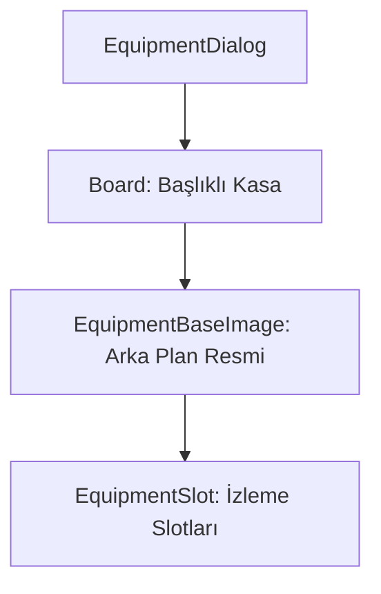

# 🎓 Metin2 Skills: `equipmentdialog.py` (Ekipman Görüntüleme)

`equipmentdialog.py`, bir oyuncunun üzerine sağ tıklayıp "Ekipman" (View Equipment) dediğinizde, o oyuncunun giydiği eşyaları görmenizi sağlayan penceredir.

---

## 🔍 Neleri Yönetir?

### 1. Rakip Karakter Figürü (`EquipmentBaseImage`)
Arka planda karakterin giydiği eşyaların konumlarını temsil eden insan figürlü bir resim (`equipment_bg_without_ring.tga`) barındırır.

### 2. Salt Okunur Slotlar (`EquipmentSlot`)
Buradaki slotlar sadece görüntüleme amaçlıdır. Oyuncu bu penceredeki eşyaları hareket ettiremez veya çıkaramaz.
- **`index`**: 0-10 arası standart ekipman slotlarını, 23 nolu index ise genellikle kuşak veya pelerin gibi ek slotları temsil eder.

### 3. Başlık (`Title`)
Pencerenin başlığında ekipmanına bakılan oyuncunun ismi (`Character Name`) dinamik olarak görünür.

---

## 🛠️ Modifikasyon ve Kritik Uyarılar

### ✅ Yeni Slot Ekleme:
Eğer sunucunda yeni ekipman türleri (Örn: "Yüzükler") varsa, bu pencereye de ilgili koordinatlarla yeni slotlar eklemelisin. Aksi halde başkasının ekipmanına baktığında o eşyalar görünmez.

### ⚠️ Görsel Senkronizasyon:
`equipment_bg_without_ring.tga` dosyası, yüzük slotlarının olmadığı eski tip bir arka plandır. Eğer sisteminde yüzük slotları varsa, bu görseli yüzüklerin yerini gösteren yeni bir resimle değiştirmelisin.

---

## 📉 equipmentdialog.py Tasarım Hiyerarşisi

---

**Veri Akışı:** `Server (View Equipment Packet)` -> `root/uiequipmentdialog.py` -> `equipmentdialog.py` -> Ekran.
