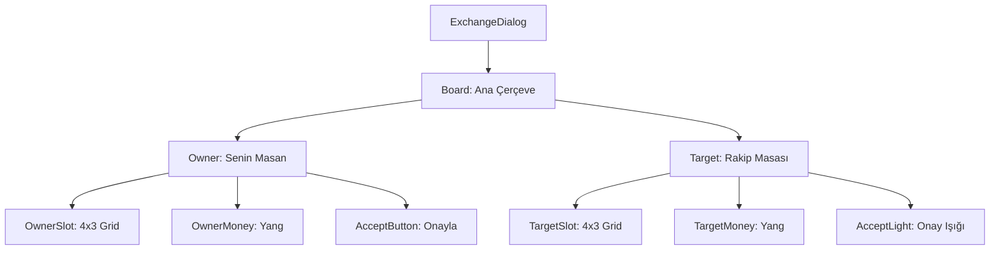

# 🎓 Metin2 Skills: `exchangedialog.py` (Ticaret Penceresi)

`exchangedialog.py`, iki oyuncu arasında eşya ve Yang alışverişi yapılmasını sağlayan karşılıklı ticaret arayüzüdür. Pencere, simetrik iki ana bölümden (`Owner` ve `Target`) oluşur.

---

## 🔍 Neleri Yönetir?

### 1. Kendi Bölümün (`Owner`)
- **`Owner_Slot`**: Ticaret masasına koyduğun eşyaların göründüğü 4x3 boyutundaki ızgaradır.
- **`Owner_Money`**: Karşı tarafa vermek istediğin Yang miktarını belirlediğin alandır.
- **`Owner_Accept_Button`**: Ticareti onayladığını belirten butondur.

### 2. Rakip Bölümü (`Target`)
- **`Target_Slot`**: Karşı oyuncunun masaya koyduğu eşyaları izlediğin alandır.
- **`Target_Accept_Light`**: Karşı oyuncunun ticareti onaylayıp onaylamadığını gösteren görsel işarettir (`accept_button_on.sub`).

### 3. Ayırıcı Çizgi (`Middle_Bar`)
İki tarafın masasını birbirinden ayıran görsel elementtir.

---

## 🛠️ Modifikasyon ve Kritik Uyarılar

### ✅ Slot Sayısını Artırma:
Eğer ticarette aynı anda daha fazla eşya (Örn: 4x6) takas edilmesini istiyorsan, `x_count` veya `y_count` değerlerini artırmalı ve pencere `height` değerini buna göre büyütmelisin.

### ⚠️ Kabul Işığı (Accept Light):
Ticaret güvenliği için `Target_Accept_Light` çok kritiktir. Karşı taraf onay verdiğinde bu ışık yanar. Eğer bu görsel doğru tanımlanmazsa, oyuncu karşı tarafın onayladığını göremez.

---

## 📉 exchangedialog.py Tasarım Hiyerarşisi

---

**Veri Akışı:** `Server (Exchange Packets)` -> `root/uiexchange.py` -> `exchangedialog.py` -> Ekran.
