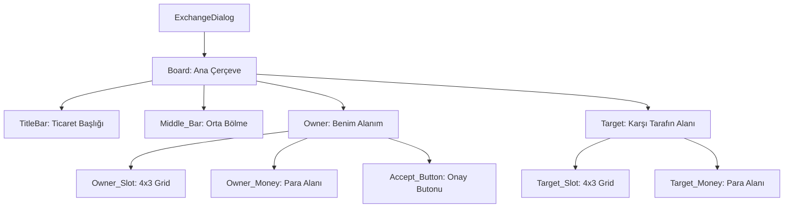

# 🎓 Metin2 Skills: `exchangedialog.py` (Ticaret Penceresi Tasarımı)

`exchangedialog.py`, iki oyuncu arasında eşya ve para transferi yapılırken açılan "Ticaret" ekranının görsel ve teknik yerleşim planıdır.

---

## 🔍 Neleri Yönetir?

### 1. İki Taraflı Yapı (`Owner` & `Target`)
Pencereyi tam ortadan ikiye böler:
- **`Owner`**: Sizin koyduğunuz eşyalar ve para.
- **`Target`**: Karşı tarafın koyduğu eşyalar ve para.

### 2. Eşya Izgarası (`grid_table`)
Standart olarak 4x3 (12 slot) boyutunda olan eşya koyma alanlarını yönetir. Her bir kare 32x32 piksel boyutundadır.

### 3. Kabul Işıkları (`Accept_Light`)
Oyuncular "Kabul" butonuna bastığında yanan (genellikle kırmızıdan yeşile dönen) onay göstergelerinin konumlarını belirler.

### 4. Para Giriş Alanları (`Owner_Money`)
Ticarette verilecek Yang miktarının yazıldığı kutucukların ve üzerindeki metinlerin yerleşimini yönetir.

---

## 🛠️ Modifikasyon ve Kritik Uyarılar

### ✅ Ticaret Kapasitesini Artırma:
Eğer aynı anda daha fazla eşya takas etmek istiyorsan, `grid_table` içindeki `y_count` değerini artırarak (Örn: 3'ten 6'ya) slot sayısını 24'e çıkarabilirsin. (Tabii pencere boyutu olan `height` değerini de artırman gerekir).

### ✅ Buton Tasarımları:
"Kabul" veya "İptal" butonlarını daha büyük veya farklı renklerde yapmak için `default_image` yollarını güncelleyebilirsin.

### ⚠️ Senkronizasyon:
Bu dosyadaki slot sayısı, sunucu tarafındaki ticaret sistemi (`exchange.cpp`) ile uyumlu olmalıdır. Sadece görseli artırmak tek başına yeterli olmayabilir.

---

## 🚨 Hata Ayıklama (Debug)

**"Karşı tarafın koyduğu eşyaları göremiyorum" sorunu:**
1.  `Target_Slot` içindeki koordinatların `Owner_Slot` ile çakışmadığından emin ol.
2.  `Middle_Bar` (Orta çizgi) görselinin pencereleri tam ayırdığını kontrol et.

---

## 📉 exchangedialog.py Yerleşim Planı

---

**Sonuç:** `exchangedialog.py`, oyun ekonomisinin "Güvenlik Kapısıdır". Her iki tarafın da neyi takas ettiğini net bir şekilde görmesini sağlayan bir düzen sunar.
