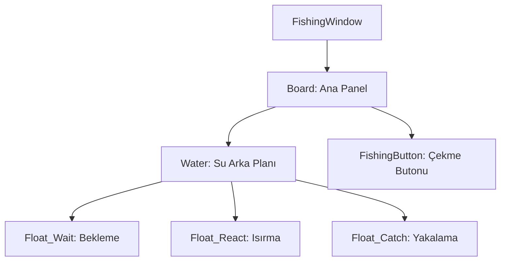

# 🎓 Metin2 Skills: `fishingwindow.py` (Balık Tutma Arayüzü)

`fishingwindow.py`, oyuncunun oltasını suya attığında açılan ve balığın oltaya vurup vurmadığını, çekme anını takip ettiği animasyonlu mini oyun penceresidir.

---

## 🔍 Neleri Yönetir?

### 1. Su Animasyonu (`Water`)
Pencerenin ortasında duran ve su dalgalanması efekti veren 7 karelik (`00.dds` - `06.dds`) bir animasyondur.

### 2. Olta Durumları (`Float`)
Balık tutma sürecinin farklı aşamalarını temsil eden animasyon gruplarını barındırır:
- **`Float_Wait`**: Oltanın su üzerinde hareketsiz durduğu an.
- **`Float_Throw`**: Oltanın suya ilk atılma anı.
- **`Float_React`**: Balığın yemi ısırdığı (Oltanın titrediği) kritik an.
- **`Float_Catch`**: Balığın başarıyla çekilme animasyonu.

### 3. Balık İsmi (`FishName`)
Eğer bir balık oltaya takıldıysa, o anki durumu veya balık türünü belirten metin alanıdır.

---

## 🛠️ Modifikasyon ve Kritik Uyarılar

### ✅ Animasyon Hızı:
Eğer oltanın daha hızlı veya yavaş titremesini istiyorsan, `Float_React` altındaki `delay` değerini değiştirebilirsin. Düşük değerler animasyonu hızlandırır.

### ⚠️ Görsel Senkronizasyon:
Balık tutma sistemini tamamen görselleştirmek istersen `FISHING_PATH` üzerindeki `.dds` ve `.tga` dosyalarını yeni tasarımlarla değiştirebilirsin. Ancak animasyon kare sayısının (Örn: 14 kare) `.py` içindeki listeyle eşleşmesi gerekir.

---

## 📉 fishingwindow.py Tasarım Hiyerarşisi

---

**Veri Akışı:** `Server (Fishing Packets)` -> `root/uifishing.py` -> `fishingwindow.py`.
