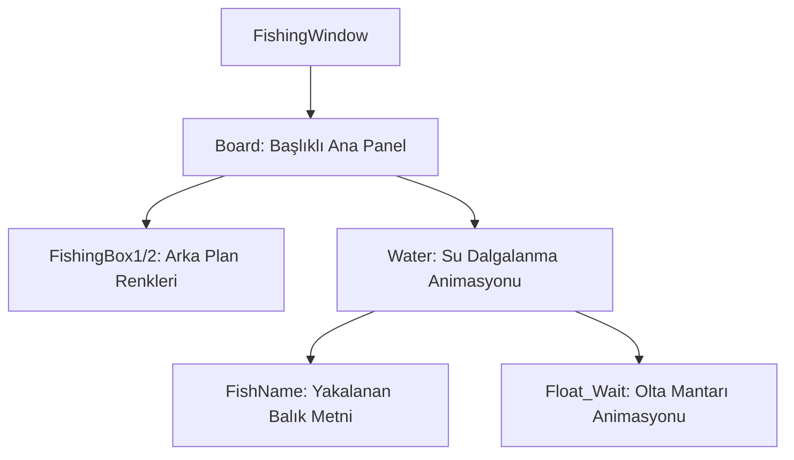

# 🎓 Metin2 Skills: `fishingwindow.py` (Balık Tutma Arayüzü Tasarımı)

`fishingwindow.py`, oyuncu denize veya göle olta attığında açılan balık tutma (Fishing) mini-game arayüzünün tasarım dosyasıdır.

---

## 🔍 Neleri Yönetir?

### 1. Su Animasyonu (`Water`)
`ani_image` nesnesi ile suyun dalgalanmasını sağlayan 7 karelik bir DDS animasyonu oynatır (`water/00.dds` - `06.dds`).

### 2. Balık Bekleme Animasyonu (`Float_Wait`)
Oltanın mantarının (Float) suyun üstünde beklemesini veya hareket etmesini gösteren animasyonu yönetir.

### 3. Çerçeve ve Arka Plan (`FishingBox1`, `FishingBox2`)
Arayüzün dış çerçevesini ve su animasyonunun oturduğu gri/siyah altlık kutularını oluşturur.

### 4. Balık İsmi (`FishName`)
Yakalanma ihtimali olan balığın (veya oltaya takılan nesnenin) ismini gösteren statik metin alanını yönetir.

---

## 🛠️ Modifikasyon ve Kritik Uyarılar

### ✅ Balık Botu Tespiti:
Bot yazılımları genellikle ekran okuma veya paket gönderme yöntemleriyle çalışır. Bu pencere aktif olduğunda arka planda UI güncellemeleri tetiklenir. Çerçeve boyutlarını (Örn: `131x131`) değiştirirseniz pixel-search tabanlı basit botları kırabilirsiniz.

### ⚠️ Gecikme (Delay) Değerleri:
`delay : 7` gibi değerler animasyonun hızını belirler. Bu değeri çok küçültürseniz dalgalar aşırı hızlı akar, büyütürseniz oyun kasıyor gibi görünür.

---

## 📉 fishingwindow.py Yapısı

**Sonuç:** `fishingwindow.py`, oyuncuyu aksiyondan uzaklaştırıp daha sakin bir mini oyuna odaklayan, görsel tabanlı bir sistemin merkezidir.
