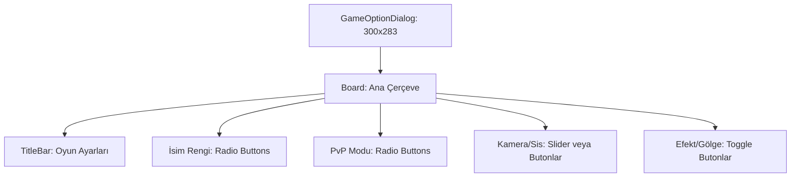

# 🎓 Metin2 Skills: `gameoptiondialog.py` (Oyun Seçenekleri Tasarımı)

`gameoptiondialog.py`, oyuncunun PvP modu, isim rengi, harita yakınlığı gibi oyun içi ayarları yaptığı seçenek penceresinin tasarım dosyasıdır.

---

## 🔍 Neleri Yönetir?

### 1. İsim Renk Seçimi (`name_color`)
Diğer oyuncuların başlarının üzerinde görünen isimlerin renklerini değiştirmek için kullanılan radyo butonlarını (Normal, Koyu vb.) yönetir.

### 2. PvP Modu Seçimi
Serbest savaş, barış, lonca savaşı gibi PvP modları arasında geçiş yapan buton grubunu düzenler.

### 3. Görsel Ayarlar
Sis mesafesi, kamera mesafesi, efekt yoğunluğu gibi performansla ilgili ayar satırlarının yerleşimini belirler.

### 4. Matematiksel Yerleşim Sistemi
`LINE_LABEL_X`, `LINE_DATA_X` ve `LINE_STEP` gibi değişkenlerle tüm ayar satırlarını otomatik hizalar. Bu, yeni ayar eklerken koordinat hesaplamayı kolaylaştırır.

---

## 🛠️ Modifikasyon ve Kritik Uyarılar

### ✅ Yeni Ayar Satırı Ekleme:
Mevcut düzenin altına yeni bir satır eklemek için son satırın `y` değerine `25` (satır yüksekliği) ekleyerek ve pencerenin `height` değerini artırarak yeni bir seçenek oluşturabilirsin.

### ✅ Buton Genişlikleri:
`SMALL_BUTTON_WIDTH` ve `MIDDLE_BUTTON_WIDTH` sabitleri tüm butonlarda tutarlılık sağlar. Yeni bir buton eklerken bunları kullanman önerilir.

### ⚠️ Dinamik Yükseklik:
Pencerenin yüksekliği `25*11+8` formülüyle hesaplanır (11 satır × 25 piksel + 8 padding). Satır ekleyince bu formülü güncellemelisin.

---

## 📉 gameoptiondialog.py Ayar Katmanları

---

**Sonuç:** `gameoptiondialog.py`, oyuncunun "Tercih Paneli"dir. Oyun deneyimini kişiselleştirmek için kullanılan tüm görsel kontrollerin düzenini yönetir.
