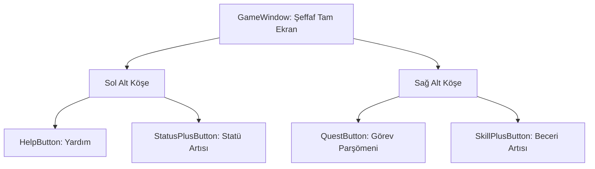

# 🎓 Metin2 Skills: `gamewindow.py` (Ana Oyun Arayüzü İkonları)

`gamewindow.py`, oyun esnasında ekranın kenarlarında beliren büyük uyarı ve bildirim ikonlarının (Örn: Statü verebilirsin, Görev geldi, Yeni beceri vb.) tasarım dosyasıdır.

---

## 🔍 Neleri Yönetir?

### 1. Artı (Plus) Butonları
Karakter seviye atladığında veya yeni görevler geldiğinde ekranın sol altında ve sağ altında çıkan şu butonları yönetir:
- **`StatusPlusButton`**: Statü puanı (STR, VIT vb.) verebileceğini gösteren "Artı" ikonu.
- **`SkillPlusButton`**: Beceri (Skill) puanı verebileceğini gösteren ikon.
- **`QuestButton`**: Yeni veya tamamlanmış bir görev (Parşömen) olduğunda çıkar.
- **`HelpButton`**: Yeni oyuncular için yardım bildirimleri.

### 2. Tıklanamaz Arka Plan
Bu pencerenin `style` değeri `("not_pick",)` olarak ayarlanmıştır. Bu sayede bu devasa pencere tüm ekranı kaplasa (`SCREEN_WIDTH`, `SCREEN_HEIGHT`) bile oyuncunun haritaya veya canavarlara tıklamasını engellemez; sadece butonlar tıklanabilir olur.

---

## 🛠️ Modifikasyon ve Kritik Uyarılar

### ✅ Uyarı Konumları:
`SCREEN_HEIGHT-100` veya `SCREEN_WIDTH-50-32` gibi matematiksel formüller, bu butonların her çözünürlükte ekranın sağ veya sol alt köşelerinde (görev çubuğunun hemen üstünde) sabit kalmasını sağlar.

### ⚠️ Görsel Senkronizasyonu:
Buradaki butonların animasyonları (`btn_bigplus_up/over/down.sub`) oyunun çok eski sürümünden beri aynıdır. Modern bir arayüz yaparken bu büyük ve kaba butonları daha şık bir "Bildirim (Notification)" sistemine dönüştürebilirsin.

---

## 📉 gamewindow.py İkon Yerleşimi

**Sonuç:** `gamewindow.py`, oyuncuyu karakterinin gelişimi hakkında sürekli bilgilendiren ve onu menülere (C, V vb.) yönlendiren "Bildirim Sistemi"dir.
